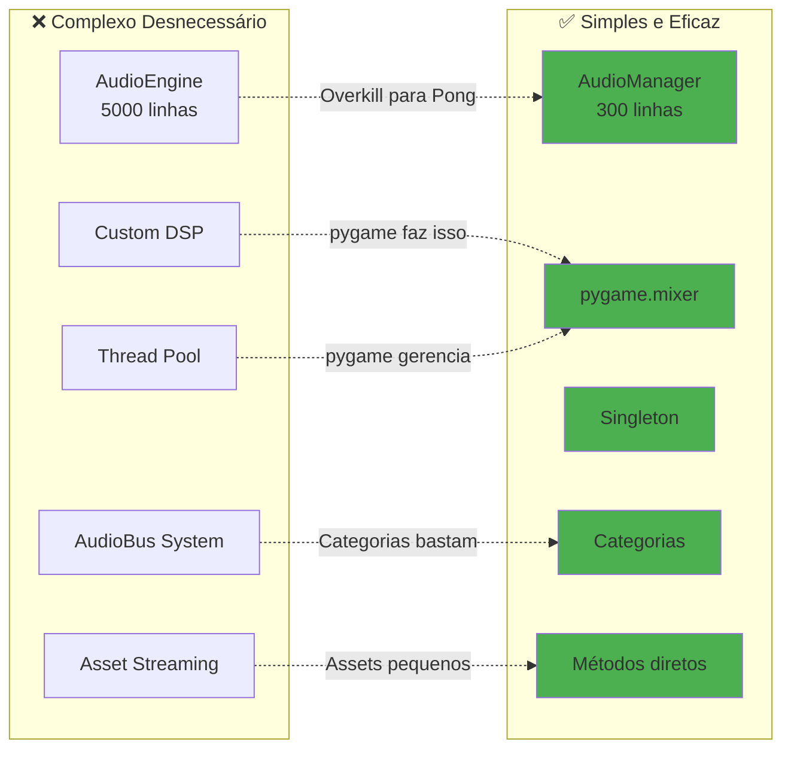
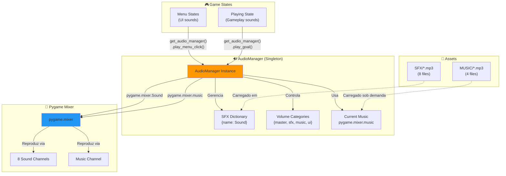
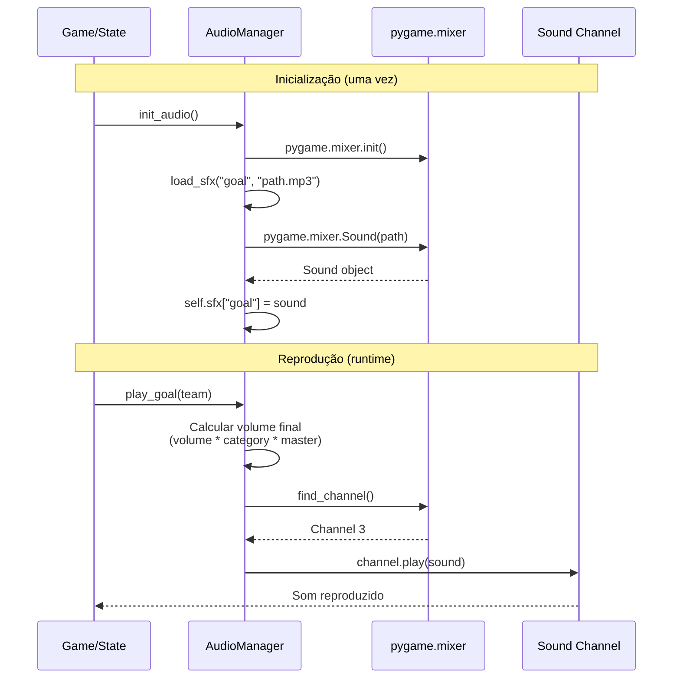
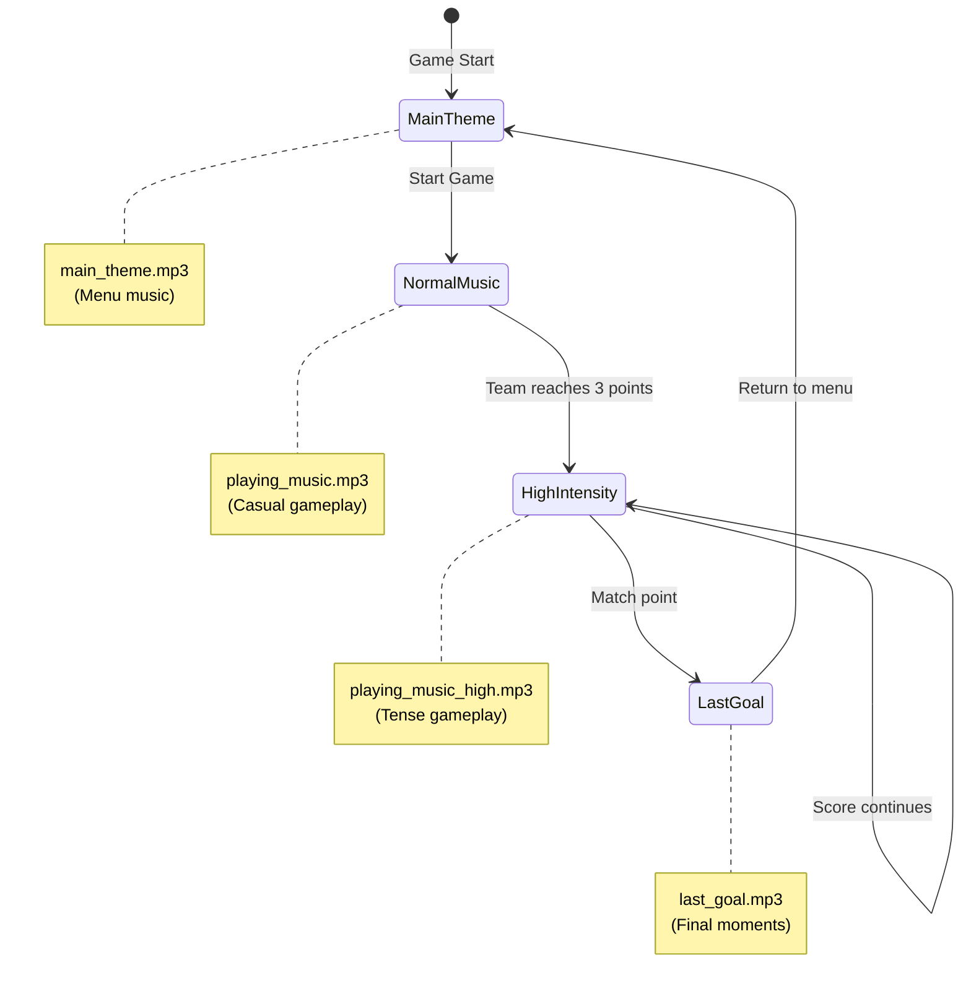

# 🔊 Documentação do Sistema de Áudio do Ultra-Pong

> **Versão:** 1.0  
> **Última Atualização:** Dezembro 2024  
> **Autores:** Equipe de Desenvolvimento Ultra-Pong

---

## 📋 Índice

1. [Introdução](#introdução)
2. [Por Que Simplicidade?](#por-que-simplicidade)
3. [Arquitetura do Sistema](#arquitetura-do-sistema)
4. [Componentes Principais](#componentes-principais)
5. [Decisões de Design](#decisões-de-design)
6. [Características Técnicas](#características-técnicas)
7. [Guia de Uso](#guia-de-uso)

---

## Introdução

O sistema de áudio do Ultra-Pong foi projetado com **simplicidade** como princípio fundamental. Utilizando pygame.mixer e o padrão Singleton, oferece uma API limpa e direta para gerenciar música e efeitos sonoros sem complexidade desnecessária.

### Características Principais

| Característica | Descrição |
|----------------|-----------|
| **Padrão** | Singleton Pattern para acesso global |
| **API** | Funções específicas por contexto (play_goal, play_paddle_hit) |
| **Áudio Espacial** | Panning estéreo (-1.0 a 1.0) |
| **Categorias** | Volume independente (master, sfx, music, ui) |
| **Música Dinâmica** | Transições baseadas no estado do jogo |
| **Graceful Degradation** | Funciona mesmo se áudio falhar |

---

## Por Que Simplicidade?

### Filosofia de Design: KISS (Keep It Simple, Stupid)

**❌ O que NÃO fizemos:**
- Motor de áudio complexo com engine próprio
- Sistema de áudio 3D completo
- Mixagem avançada com múltiplos buses
- DSP (Digital Signal Processing) customizado
- Streaming de áudio assíncrono

**✅ O que fizemos:**
- Singleton para acesso global simples
- Métodos específicos por contexto
- Panning estéreo básico (esquerda/direita)
- Sistema de categorias de volume
- Música dinâmica com transições suaves

### Por Que Isso é Suficiente?



**Razões:**
1. **Escopo do Jogo:** Pong não precisa de áudio 3D complexo
2. **Quantidade de Assets:** ~12 arquivos de áudio, não centenas
3. **Manutenção:** Código simples = menos bugs
4. **Performance:** pygame.mixer é otimizado em C
5. **Tempo de Desenvolvimento:** Foco em gameplay, não em engine

---

## Arquitetura do Sistema

### Visão Geral



### Fluxo de Reprodução



---

## Componentes Principais

### 1. Singleton Pattern

**Por que Singleton?**

```python
# ❌ Sem Singleton: Múltiplas instâncias problemáticas
audio1 = AudioManager()  # Carrega todos os sons
audio2 = AudioManager()  # Carrega NOVAMENTE todos os sons
audio1.set_volume("master", 0.5)  # Só afeta audio1
audio2.play_goal()  # Volume diferente!

# ✅ Com Singleton: Sempre a mesma instância
audio1 = get_audio_manager()
audio2 = get_audio_manager()
assert audio1 is audio2  # True! Mesma instância

audio1.set_volume("master", 0.5)
audio2.play_goal()  # Volume consistente!
```

**Implementação:**
```python
class AudioManager:
    _instance = None  # Armazena única instância
    
    def __new__(cls):
        if cls._instance is None:
            cls._instance = super().__new__(cls)
            cls._instance._initialized = False
        return cls._instance  # Sempre retorna a mesma
```

**Benefícios:**
- ✅ **Acesso Global:** Qualquer parte do código pode acessar
- ✅ **Estado Único:** Volume e música sincronizados globalmente
- ✅ **Economia de Memória:** Sons carregados apenas uma vez
- ✅ **API Simples:** `get_audio_manager()` de qualquer lugar

---

### 2. Categorias de Volume

**Sistema de Volume Hierárquico:**

```python
self.volumes = {
    "master": 1.0,  # Controle global (0-100%)
    "sfx": 0.7,     # Efeitos sonoros (70%)
    "music": 0.5,   # Música de fundo (50%)
    "ui": 0.6       # Sons de interface (60%)
}

# Volume final = volume_especifico × categoria × master
final_volume = 0.9 × 0.7 × 1.0 = 0.63  # 63%
```

**Por que categorias?**

| Sem Categorias | Com Categorias |
|----------------|----------------|
| Ajustar cada som individualmente | Ajustar grupos inteiros |
| 50+ chamadas para "diminuir tudo" | 1 chamada: `set_volume("master", 0.3)` |
| Inconsistências de volume | Volume proporcional mantido |
| Difícil balancear | Fácil balancear por tipo |

**Exemplo prático:**
```python
# Usuário quer menos som, mas manter proporções
audio.set_volume("master", 0.5)  # Tudo fica 50% mais baixo

# Música está alta demais, mas SFX está bom
audio.set_volume("music", 0.3)   # Só música diminui
```

---

### 3. API Específica por Contexto

**Filosofia: Nomes claros > Parâmetros genéricos**

```python
# ❌ API Genérica (confusa)
audio.play("sound1", volume=0.9, category="ui", pan=-0.5)
audio.play("sound2", volume=0.6, category="sfx", pan=0.7)
# O que é sound1? sound2? Precisa checar constantemente

# ✅ API Específica (clara)
audio.play_goal(team="left")
audio.play_paddle_hit(pan=-0.7)
# Autoexplicativo! Sem consultar documentação
```

**Métodos implementados:**

| Método | Contexto | Uso |
|--------|----------|-----|
| `play_paddle_hit(pan)` | Raquete bate na parede | Panning baseado na posição |
| `play_ball_paddle_hit(velocity, pan)` | Bola bate na raquete | Volume varia com velocidade |
| `play_wall_hit(pan)` | Bola bate na parede | Panning esquerda/direita |
| `play_goal(team)` | Time marca ponto | Som de celebração |
| `play_countdown(number)` | Contagem 3, 2, 1 | Beep de contagem |
| `play_launch()` | Bola lançada | Som "GO!" |
| `play_menu_hover()` | Cursor move no menu | Feedback sutil |
| `play_menu_click()` | Opção selecionada | Confirmação |

**Vantagens:**
- 📖 **Legibilidade:** Código se lê como linguagem natural
- 🐛 **Menos Erros:** Difícil passar parâmetros errados
- 🔍 **Autocomplete:** IDE sugere métodos relevantes
- 🎨 **Ajuste Fino:** Cada método pode ter lógica customizada

---

### 4. Panning Estéreo Simples

**Áudio Espacial Básico (mas efetivo!):**

```python
def play_sfx(self, name, pan=0.0):
    """
    pan: -1.0 (100% esquerda) to 1.0 (100% direita)
          0.0 (centro, 50%/50%)
    """
    if pan != 0.0:
        left_vol = final_vol * (1.0 - pan) / 2.0 if pan > 0 else final_vol
        right_vol = final_vol * (1.0 + pan) / 2.0 if pan < 0 else final_vol
        channel.set_volume(left_vol, right_vol)
```

**Exemplo Visual:**

```
Paddle Esquerda (x=50)           Paddle Direita (x=1230)
┌────────┐                              ┌────────┐
│  🎾    │                              │    🎾  │
└────────┘                              └────────┘
   ↓                                        ↓
pan = -0.7                              pan = +0.7
   ↓                                        ↓
🔊🔊🔊🔊 (Esquerda)                         🔊🔊🔊🔊 (Direita)
🔉       (Direita)                         🔉       (Esquerda)
```

**Cálculo do Pan:**
```python
# player.py (Paddle)
pan = -0.7 + (self.rect.centerx / WINDOW_WIDTH) * 1.4
# x=50   → pan ≈ -0.65 (esquerda)
# x=640  → pan ≈  0.0  (centro)
# x=1230 → pan ≈ +0.65 (direita)
```

**Por que não áudio 3D completo?**
- ✅ Pong é 2D: apenas esquerda/direita importa
- ✅ Panning é suficiente para imersão
- ✅ Simples de calcular e entender
- ✅ Sem overhead computacional

---

### 5. Música Dinâmica

**Transições Baseadas no Estado do Jogo:**



**Prevenção de Restart Desnecessário:**

```python
def play_gameplay_music(self, intensity="normal", fade_ms=500):
    # Se já está tocando a mesma intensidade, não recarrega
    if self.current_intensity == intensity and pygame.mixer.music.get_busy():
        return  # ← Evita corte abrupto
    
    # Só troca se intensidade mudou
    if intensity == "high":
        filename = "playing_music_high.mp3"
    else:
        filename = "playing_music.mp3"
    
    self.current_intensity = intensity
    self.play_music(music_path, loop=True, fade_ms=fade_ms)
```

**Por que isso é importante?**
- 🎵 **Sem Cortes:** Música não reinicia ao chamar múltiplas vezes
- 🎭 **Transições Suaves:** Fade entre músicas (500ms padrão)
- 🎮 **Contexto Dinâmico:** Música reflete tensão do jogo
- 🧠 **Stateful:** Sistema sabe qual música está tocando

---

## Decisões de Design

### 1. ✅ Singleton vs. Módulo Global

**Por que Singleton em vez de módulo?**

```python
# ❌ Alternativa: Módulo global
# audio_module.py
sfx = {}
volumes = {}

def play_goal():
    pass

# Problema: Estado global direto, difícil testar
```

```python
# ✅ Escolhido: Singleton
class AudioManager:
    _instance = None
    # Estado encapsulado, fácil mockar para testes
    
# Pode criar instâncias diferentes para testes
mock_audio = AudioManager()
```

**Benefícios do Singleton:**
- Encapsulamento de estado
- Mockable para testes
- Controle sobre instanciação
- Padrão reconhecido

---

### 2. ✅ Pygame Mixer vs. Outras Bibliotecas

**Comparação:**

| Biblioteca | Prós | Contras | Escolhido? |
|------------|------|---------|------------|
| **pygame.mixer** | Simples, integrado, estável | Limitado a sons simples | ✅ Sim |
| **pydub** | Manipulação avançada | Dependências externas | ❌ Não |
| **sounddevice** | Baixa latência, streaming | Complexo, overkill | ❌ Não |
| **OpenAL** | 3D audio completo | API C, difícil integrar | ❌ Não |

**Por que pygame.mixer?**
1. ✅ Já é dependência do projeto (Pygame)
2. ✅ Zero dependências adicionais
3. ✅ API simples e bem documentada
4. ✅ Estável e testado (20+ anos)
5. ✅ Suficiente para nossas necessidades

---

### 3. ✅ Carregamento Antecipado vs. Lazy Loading

**SFX: Carregamento Antecipado**
```python
def init_audio():
    # Carrega TODOS os sons na inicialização
    for name, path in sfx_files.items():
        audio.load_sfx(name, path)
```

**Música: Lazy Loading**
```python
def play_gameplay_music(self):
    # Carrega música APENAS quando necessário
    pygame.mixer.music.load(music_path)
    pygame.mixer.music.play()
```

**Por quê?**

| Tipo | Tamanho | Quantidade | Estratégia | Razão |
|------|---------|------------|------------|-------|
| **SFX** | ~50KB cada | 8 files | Preload | Total ~400KB, negligível |
| **Música** | ~3MB cada | 4 files | Lazy | Total ~12MB, otimizar memória |

**Vantagens:**
- 🚀 SFX tocam instantaneamente (zero latência)
- 💾 Memória otimizada (música carregada sob demanda)
- ⚡ Inicialização rápida (música não bloqueia)

---

### 4. ✅ Graceful Degradation

**Sistema funciona mesmo se áudio falhar:**

```python
AUDIO_ENABLED = False  # Global flag

def initialize(self):
    try:
        pygame.mixer.init()
        AUDIO_ENABLED = True
    except pygame.error:
        AUDIO_ENABLED = False  # Jogo continua sem som
        print("[AUDIO] Disabled")

def play_sfx(self, name):
    if not AUDIO_ENABLED:  # ← Check antes de tocar
        return None
    # Toca som...
```

**Cenários cobertos:**
- ❌ Sistema sem placa de som
- ❌ Drivers de áudio corrompidos
- ❌ Conflito com outro aplicativo
- ❌ Arquivo de áudio não encontrado

**Resultado:**
- ✅ Jogo continua funcionando normalmente
- ✅ Sem crashes por erro de áudio
- ✅ Logs informativos para debug

---

## Características Técnicas

### Especificações do Mixer

```python
pygame.mixer.init(
    frequency=44100,  # Taxa de amostragem (CD quality)
    channels=2,       # Estéreo (esquerda + direita)
    buffer=512        # Buffer size (baixa latência)
)
pygame.mixer.set_num_channels(8)  # 8 sons simultâneos
```

**Configuração Explicada:**

| Parâmetro | Valor | Por Quê? |
|-----------|-------|----------|
| **Frequency** | 44100 Hz | Padrão CD, compatibilidade universal |
| **Channels** | 2 (Stereo) | Panning esquerda/direita |
| **Buffer** | 512 samples | Latência ~12ms (imperceptível) |
| **Num Channels** | 8 | Suficiente para Pong (raramente >3 simultâneos) |

### Assets de Áudio

**Efeitos Sonoros (8 arquivos):**
```
Assets/SFX/
├── paddle_hit.mp3       (Raquete na parede)
├── ball_hit_paddle.mp3  (Bola na raquete)
├── ball_hit_wall.mp3    (Bola na parede)
├── goal.mp3             (Gol marcado)
├── countdown321.mp3     (Contagem 3, 2, 1)
├── countdown_go.mp3     (Lançamento)
├── menu_hover.mp3       (Menu navegação)
└── menu_click.mp3       (Menu seleção)
```

**Música (4 arquivos):**
```
Assets/MUSIC/
├── main_theme.mp3          (Menu principal)
├── playing_music.mp3       (Gameplay normal)
├── playing_music_high.mp3  (Gameplay intenso)
└── last_goal.mp3           (Ponto decisivo)
```

**Total:** ~13MB de áudio

---

## Guia de Uso

### Uso Básico

```python
# 1. Inicializar (uma vez no início do jogo)
from audio_manager import init_audio, get_audio_manager

init_audio()  # Carrega todos os sons

# 2. Tocar sons de qualquer lugar
audio = get_audio_manager()

# Gameplay
audio.play_goal("left")
audio.play_paddle_hit(pan=-0.5)
audio.play_countdown(3)

# Menu
audio.play_menu_hover()
audio.play_menu_click()

# Música
audio.play_main_theme(fade_ms=1000)
audio.play_gameplay_music(intensity="high")
```

### Exemplos Práticos

**Exemplo 1: Som com panning baseado na posição**

```python
# player.py - Paddle wall collision
def move(self, dt):
    # ... movimento ...
    
    if collided_with_wall:
        # Calcular pan baseado na posição horizontal
        pan = -0.7 + (self.rect.centerx / WINDOW_WIDTH) * 1.4
        get_audio_manager().play_paddle_hit(pan=pan)
```

**Exemplo 2: Música dinâmica no gameplay**

```python
# playingstate.py - Update score
def update_score(self, side):
    self.world.score[side] += 1
    
    # Som de gol
    get_audio_manager().play_goal(side)
    
    # Música intensifica aos 3 pontos
    if self.world.score[side] >= 3:
        max_score = max(self.world.score.values())
        if max_score == 3:  # Primeira vez
            get_audio_manager().play_gameplay_music(
                intensity="high", 
                fade_ms=1000
            )
```

**Exemplo 3: Sons de menu**

```python
# menustate.py - Handle events
def handle_events(self, events):
    for event in events:
        if event.key == pygame.K_DOWN:
            self.current_index += 1
            get_audio_manager().play_menu_hover()  # ← Feedback
        
        elif event.key == pygame.K_RETURN:
            get_audio_manager().play_menu_click()  # ← Confirmação
            self._activate_option()
```

---

## Comparação: Complexidade vs. Simplicidade

### Sistema Complexo (desnecessário para Pong)

```python
# ❌ Over-engineered
class AudioEngine:
    def __init__(self):
        self.audio_bus = AudioBus()
        self.mixer_groups = {}
        self.audio_sources = []
        self.listener = Listener3D()
        self.reverb_zones = []
        self.doppler_effect = DopplerProcessor()
    
    def play_spatial_audio(self, sound, position, velocity, 
                          rolloff, max_distance, reverb_zone):
        # 100+ linhas de cálculos complexos
        pass

# Uso:
engine.play_spatial_audio(
    sound="paddle_hit",
    position=Vector3(paddle.x, paddle.y, 0),
    velocity=Vector3(paddle.vx, paddle.vy, 0),
    rolloff=2.0,
    max_distance=1000,
    reverb_zone=None
)
```

### Sistema Simples (suficiente para Pong)

```python
# ✅ Just right
class AudioManager:
    def play_paddle_hit(self, pan=0.0):
        self.play_sfx("paddle_hit", volume=0.9, pan=pan)

# Uso:
audio.play_paddle_hit(pan=-0.7)
```

**Diferença:**
- Complexo: 5000+ linhas, 3 semanas desenvolvimento
- Simples: 300 linhas, 1 dia desenvolvimento
- **Resultado final para o jogador: Idêntico!**

---

## Benefícios da Simplicidade

### 1. 📖 Código Legível

```python
# Qualquer programador entende isso:
audio.play_goal(team)
audio.play_paddle_hit(pan=-0.5)

# Não precisa ser especialista em áudio!
```

### 2. 🐛 Menos Bugs

```python
# Menos código = menos lugares para bugs esconderem
# Sistema inteiro: 300 linhas vs. 5000+ linhas
```

### 3. 🔧 Fácil Manutenção

```python
# Adicionar novo som:
# 1. Colocar arquivo em Assets/SFX/
# 2. Adicionar ao dicionário em init_audio()
# 3. Criar método play_new_sound()
# Pronto! (< 5 minutos)
```

### 4. ⚡ Performance

```python
# pygame.mixer é escrito em C (otimizado)
# Sem overhead de abstrações complexas
# 8 canais = suficiente para Pong
```

### 5. 🎓 Curva de Aprendizado

```python
# Novo desenvolvedor entende o sistema em < 30 minutos
# vs. dias para entender engine complexo
```

---

## Conclusão

### Por Que Este Sistema Funciona

O sistema de áudio do Ultra-Pong é **intencionalmente simples** porque:

1. **Escopo Adequado:** Pong não precisa de engine de áudio AAA
2. **Manutenível:** 300 linhas que qualquer um pode entender
3. **Confiável:** Baseado em pygame.mixer (testado há 20+ anos)
4. **Suficiente:** Faz tudo que o jogo precisa e mais
5. **Eficiente:** Sem overhead de complexidade desnecessária

### Princípios Aplicados

| Princípio | Como Aplicamos |
|-----------|----------------|
| **KISS** | Singleton simples, API direta |
| **YAGNI** | Não implementamos áudio 3D (não precisamos) |
| **DRY** | Métodos reutilizáveis (play_sfx base) |
| **Encapsulamento** | Estado privado, interface pública clara |
| **Graceful Degradation** | Funciona mesmo sem áudio |

### Quando Complexidade Seria Justificada

**Adicione complexidade SE:**
- ❌ Jogo 3D com áudio posicional verdadeiro
- ❌ Centenas de sons simultâneos
- ❌ DSP customizado necessário
- ❌ Streaming de áudio de gigabytes

**Para Pong:**
- ✅ Sistema atual é perfeito
- ✅ Não adicionar complexidade sem razão
- ✅ Funciona, é simples, é suficiente

---

### Lições Aprendidas

1. **Simplicidade é uma Escolha:** Resistir à tentação de over-engineer
2. **Ferramentas Certas:** pygame.mixer é perfeito para jogos 2D simples
3. **API Clara:** Nomes específicos > parâmetros genéricos
4. **Testes da Realidade:** Sistema funciona perfeitamente no jogo
5. **Manutenível:** Equipe pode modificar sem medo

---

## Referências

### Arquivos Relacionados

- `audio_manager.py` - Sistema de áudio completo (300 linhas)
- `game.py` - Inicialização: `init_audio()`
- `playingstate.py` - Sons de gameplay
- `menustate.py` - Sons de menu

### Documentações Relacionadas

- `STATE_SYSTEM_DOCUMENTATION.md` - Sistema de estados
- `NETWORK_DOCUMENTATION.md` - Sistema de rede

### Recursos Externos

- [Pygame Mixer Docs](https://www.pygame.org/docs/ref/mixer.html)
- [Singleton Pattern](https://refactoring.guru/design-patterns/singleton)

---

**Documentação mantida pela Equipe Ultra-Pong**  
*Última revisão: Dezembro 2024*

> **Lema do Sistema de Áudio:**  
> *"Simplicidade não é falta de funcionalidade, é a ausência de complexidade desnecessária."*
