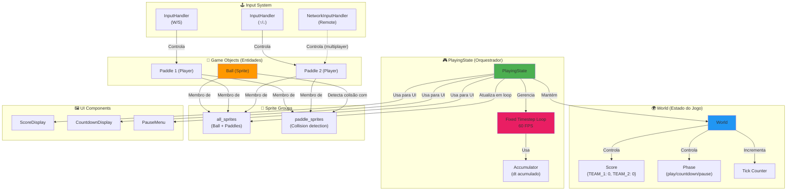
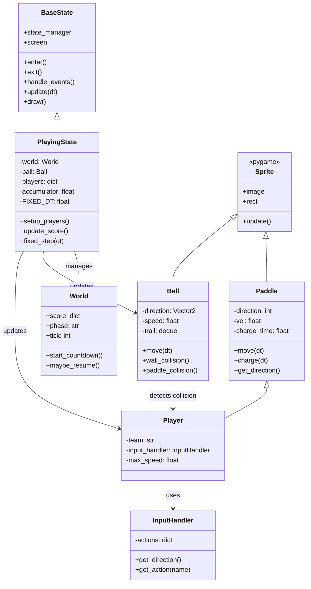
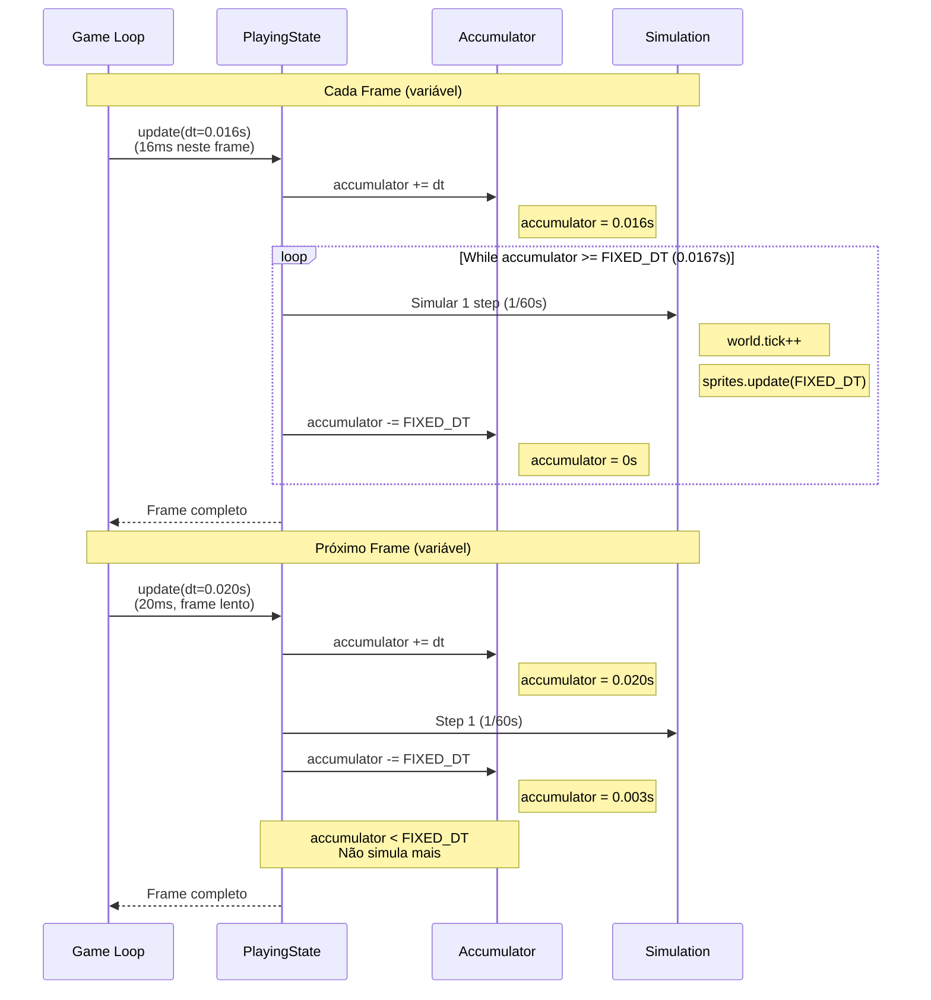
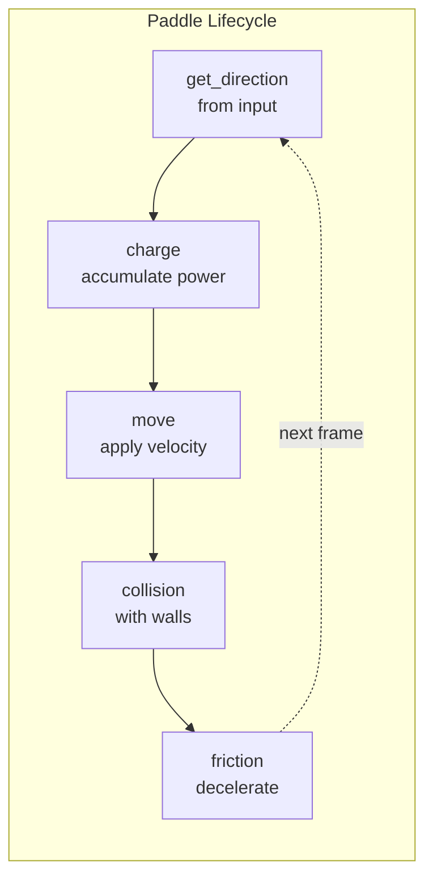
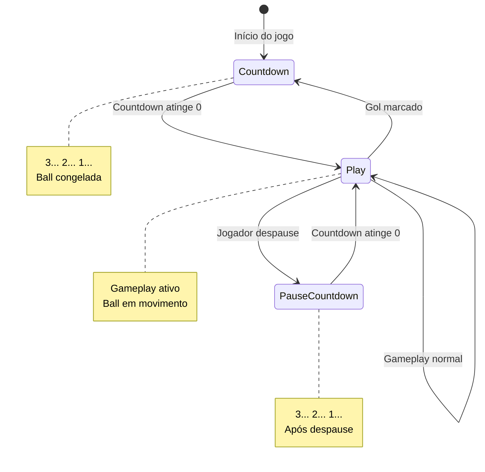
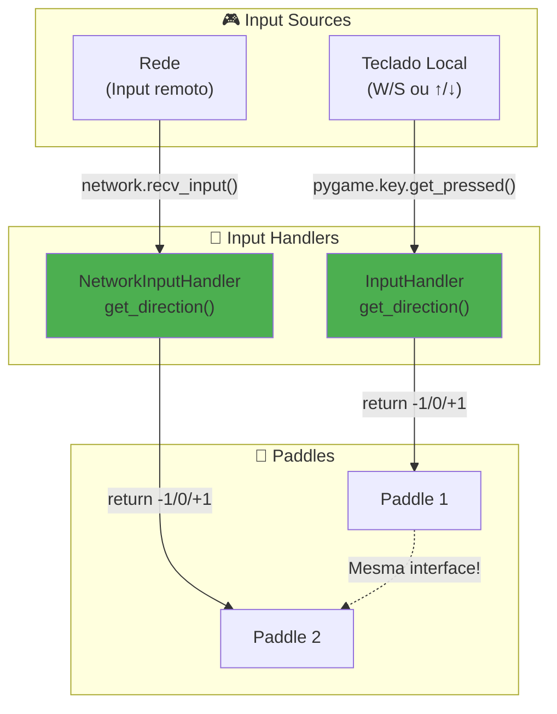
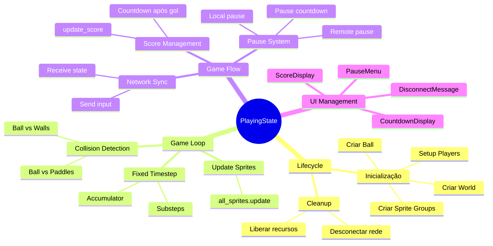
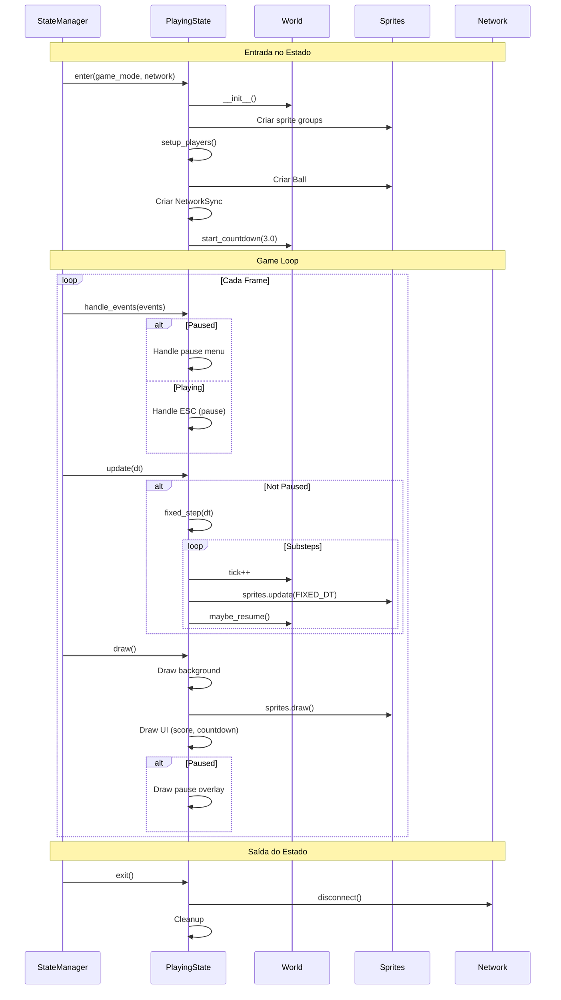
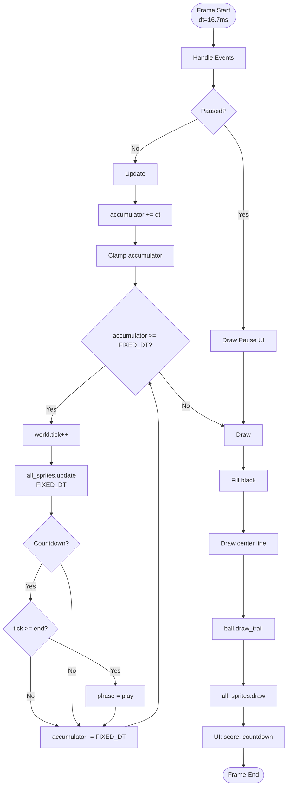

# ⚡ Documentação do Sistema de Gameplay do Ultra-Pong

> **Versão:** 1.0  
> **Última Atualização:** Dezembro 2024  
> **Autores:** Equipe de Desenvolvimento Ultra-Pong

---

## 📋 Índice

1. [Introdução](#introdução)
2. [Arquitetura do Gameplay](#arquitetura-do-gameplay)
3. [Sistema de Física](#sistema-de-física)
4. [Componentes Principais](#componentes-principais)
5. [PlayingState: O Orquestrador](#playingstate-o-orquestrador)
6. [Decisões de Design](#decisões-de-design)
7. [Fixed Timestep: Por Quê?](#fixed-timestep-por-quê)
8. [Detalhes Técnicos](#detalhes-técnicos)

---

## Introdução

O sistema de gameplay do Ultra-Pong combina física determinística, fixed timestep, e separação clara de responsabilidades para criar uma experiência de jogo fluida, previsível e multiplayer-friendly.

### Características Principais

| Característica | Descrição |
|----------------|-----------|
| **Física** | Fixed timestep a 60 FPS para consistência |
| **Colisões** | Sistema robusto de detecção com old_rect |
| **Controle** | Sistema de input abstrato e plugável |
| **Separação** | Paddle, Ball, World, PlayingState independentes |
| **Multiplayer** | Física determinística para sincronização |
| **Mecânicas** | Charge system, bounce angle, velocity transfer |

---

## Arquitetura do Gameplay

### Visão Geral de Alto Nível



### Hierarquia de Classes



---

## Sistema de Física

### Fixed Timestep Loop

**O Coração do Gameplay:**



**Implementação:**

```python
class PlayingState(BaseState):
    FIXED_DT = 1/60  # 0.0167 segundos (60 FPS)
    
    def update(self, dt):
        # dt vem do clock.tick() - variável
        self.accumulator += dt
        
        # Limitar acumulador (evitar spiral of death)
        max_accumulator = 10 * self.FIXED_DT
        if self.accumulator > max_accumulator:
            self.accumulator = max_accumulator
        
        # Simular em passos fixos
        substeps = 0
        while self.accumulator >= self.FIXED_DT and substeps < 10:
            # Física determinística
            self.world.tick += 1
            self.all_sprites.update(self.FIXED_DT)
            
            self.accumulator -= self.FIXED_DT
            substeps += 1
```

**Por que Fixed Timestep?**

| Sem Fixed Timestep | Com Fixed Timestep |
|--------------------|-------------------|
| ❌ Física variável (FPS afeta gameplay) | ✅ Física consistente (sempre 60 Hz) |
| ❌ Impossível sincronizar multiplayer | ✅ Determinístico para multiplayer |
| ❌ Bugs difíceis de reproduzir | ✅ Bugs reproduzíveis consistentemente |
| ❌ Colisões falham em FPS baixo | ✅ Colisões sempre precisas |

---

## Componentes Principais

### 1. Paddle (Raquete)

**Arquitetura:**



**Sistema de Charge (Mecânica Única):**

```python
class Paddle:
    def charge(self, dt):
        if self.direction != 0:  # Input pressionado
            # Acumular carga
            self.charge_time = min(self.charge_max, self.charge_time + dt)
            self.prev_input = self.direction
        
        else:  # Input solto
            if self.is_charging:
                # Tap rápido (< 0.2s)
                if self.charge_time < 0.20:
                    launch_speed = max_speed * 0.5
                
                # Carga completa (> 0.2s)
                else:
                    power = self.charge_time / 1.5  # 0-1
                    launch_speed = max_speed * (1.0 + power * 2.5)
                
                # Aplicar velocidade
                self.vel = launch_speed * (1 if prev_input > 0 else -1)
```

**Mecânica Visual:**

```
Input Timeline:
0s         0.2s                    1.5s
├──────────┼───────────────────────┤
   Tap        Carga Parcial     Carga Máxima
 (50% vel)   (100-250% vel)    (350% vel)

Nudge Visual:
Enquanto segura: paddle "vibra" levemente
Força visual = charge_time / charge_max
```

**Por que este sistema?**

✅ **Skill-based:** Jogador precisa temporizar release  
✅ **Feedback Tátil:** Nudge mostra carga visualmente  
✅ **Balanced:** Tap rápido ainda funciona, charge é recompensa  
✅ **Estratégia:** Escolher entre posicionamento vs. velocidade

---

### 2. Ball (Bola)

**Sistema de Física:**

```python
class Ball:
    def move(self, dt):
        # Movimento separado X e Y
        self.rect.x += self.direction.x * self.speed * dt
        self.paddle_collision('horizontal')
        
        self.rect.y += self.direction.y * self.speed * dt
        self.paddle_collision('vertical')
```

**Por que separar X e Y?**

```
Exemplo: Ball indo ↗ (direita-cima)

Frame N:
┌─────────────────┐
│        ball     │  ← Position (100, 100)
│         ●       │
│                 │
│      paddle ▌   │
└─────────────────┘

Move X primeiro:
┌─────────────────┐
│           ball  │  ← X moved (110, 100)
│            ●    │  ← Colide horizontalmente!
│                 │
│      paddle ▌   │  ← Detecta colisão X
└─────────────────┘

Depois move Y:
┌─────────────────┐
│                 │
│           ball  │  ← Y moved (110, 90)
│            ●    │
│      paddle ▌   │
└─────────────────┘
```

**Vantagens:**
- ✅ Detecta colisões em cada eixo separadamente
- ✅ Resolve "tunneling" (ball atravessar paddle)
- ✅ Permite bounce angle preciso

---

**Sistema de Bounce Angle:**

```python
def _handle_paddle_collision(self, paddle):
    # 1. Calcular onde a bola bateu (-1 topo, +1 fundo)
    relative_intersect = (paddle.centery - ball.centery) / (paddle.height/2)
    # Exemplo: bola bate no meio → 0.0
    #          bola bate no topo → -1.0
    #          bola bate no fundo → +1.0
    
    # 2. Smooth curve (quadrático para controle fino)
    smooth = relative_intersect * abs(relative_intersect)
    # Linear:     -1.0 → -1.0,  -0.5 → -0.5,  0 → 0
    # Quadrático: -1.0 → -1.0,  -0.5 → -0.25, 0 → 0
    #             ^mais controle no centro
    
    # 3. Converter para ângulo (max 60°)
    max_angle = π/3  # 60 graus
    bounce_angle = smooth * max_angle
    
    # 4. Aplicar direção
    self.direction.x = cos(bounce_angle)
    self.direction.y = -sin(bounce_angle)
```

**Visualização:**

```
Paddle:
  ┌───┐  ← Top (-1.0)     → Angle: -60° (↗)
  │   │
  │   │  ← Middle (0.0)   → Angle: 0°   (→)
  │   │
  └───┘  ← Bottom (+1.0)  → Angle: +60° (↘)

Smooth curve effect:
       -1.0          0.0          1.0
Intersect: ├──────────┼──────────┤
           -60°       0°        +60°
Linear:    └──────────┴──────────┘
           steep      flat     steep

           -60°       0°        +60°
Quadratic: └────────╱─╲────────┘
           steep  gentler  steep
                   ^mais controle
```

**Velocity Transfer (Paddle afeta bola):**

```python
# Se paddle está se movendo rápido (>150 vel)
if abs(paddle.vel) > 150:
    paddle_effect = (paddle.vel / paddle.max_launch_speed) * 0.3
    self.direction.y -= paddle_effect  # Transfere momentum
```

**Exemplo:**
```
Paddle movendo DOWN (vel=+500):
  Ball vindo ←
  Ball depois bounce: ↙ (pegou momentum do paddle)

Paddle movendo UP (vel=-500):
  Ball vindo ←
  Ball depois bounce: ↖ (pegou momentum contrário)
```

---

**Sistema de Trail (Rastro Visual):**

```python
class Ball:
    def __init__(self):
        self.trail = deque(maxlen=6)  # Últimas 6 posições
        self.trail_spacing = 0.08     # 80ms entre trails
        self.trail_life = 0.4         # 400ms duração
    
    def update_trail(self, dt):
        self.last_trail_time += dt
        
        # Adicionar posição a cada 80ms
        if self.last_trail_time >= self.trail_spacing:
            self.trail.append({
                'pos': self.rect.center,
                'time': 0.0
            })
            self.last_trail_time = 0
        
        # Envelhecer trails
        for t in self.trail:
            t['time'] += dt
    
    def draw_trail(self, screen):
        for t in self.trail:
            # Alpha diminui com tempo (fade out)
            alpha = 255 * (1 - t['time'] / self.trail_life)
            # Tamanho diminui com tempo
            size = ball_size * (1 - t['time'] / self.trail_life * 0.5)
            
            # Desenhar círculo transparente
            draw_transparent_circle(screen, t['pos'], size, alpha)
```

**Efeito Visual:**

```
Frame 0:    ●
Frame 1:    ●◐
Frame 2:    ●◐◑
Frame 3:    ●◐◑◒  ← Trail completo
Frame 4:     ●◐◑◒ ← Trail mais antigo desaparece
Frame 5:      ●◐◑◒
            Ball  Trails (desaparecem gradualmente)
```

---

### 3. World (Estado do Jogo)

**Máquina de Estados da Fase:**



**Implementação:**

```python
class World:
    def __init__(self):
        self.score = {"TEAM_1": 0, "TEAM_2": 0}
        self.phase = "play"  # "play", "countdown", "pause_countdown"
        self.tick = 0
        self.countdownEndTick = None
    
    def start_countdown(self, duration, tick_rate):
        """Inicia countdown (após gol)"""
        self.phase = "countdown"
        self.countdownEndTick = self.tick + int(duration * tick_rate)
        # Exemplo: 3.0 segundos * 60 FPS = 180 ticks
    
    def maybe_resume(self):
        """Verifica se countdown terminou"""
        if self.phase == "countdown" and self.tick >= self.countdownEndTick:
            self.phase = "play"
            return True  # ← Ball pode ser lançada
        return False
```

**Por que Tick-based?**

```python
# ❌ Alternativa: Time-based
start_time = time.time()
if time.time() - start_time > 3.0:  # Problema!
    resume()
# Problema: time.time() não é sincronizável em multiplayer

# ✅ Escolhido: Tick-based
countdown_end = current_tick + 180  # 3s * 60 FPS
if current_tick >= countdown_end:  # Determinístico!
    resume()
# Vantagem: Tick sincroniza perfeitamente pela rede
```

---

### 4. InputHandler (Sistema de Input)

**Arquitetura de Abstração:**



**Interface Unificada:**

```python
class InputHandler:
    """Input local do teclado"""
    def get_direction(self):
        keys = pygame.key.get_pressed()
        return (keys[down_key] or 0) - (keys[up_key] or 0)
        # Retorna: -1 (cima), 0 (neutro), +1 (baixo)

class NetworkInputHandler:
    """Input remoto da rede"""
    def get_direction(self):
        input_state = self.network.get_remote_input()
        return input_state['direction']
        # Retorna: -1 (cima), 0 (neutro), +1 (baixo)
        # Mesma interface!

# Paddle não sabe qual tipo de handler está usando!
class Paddle:
    def get_direction(self):
        self.direction = self.input_handler.get_direction()
        # Funciona com qualquer handler
```

**Benefícios:**

✅ **Polimorfismo:** Paddle não conhece fonte de input  
✅ **Testabilidade:** Pode criar MockInputHandler para testes  
✅ **Flexibilidade:** Fácil adicionar IA ou gamepad  
✅ **Multiplayer-ready:** Troca trivial local ↔ rede

---

## PlayingState: O Orquestrador

### Responsabilidades



### Ciclo de Vida Completo



### Setup Players (Configuração Inteligente)

```python
def setup_players(self):
    if self.game_mode == "local":
        # Local co-op: 2 inputs locais
        p1 = Player("TEAM_1", InputHandler(K_w, K_s), groups)
        p2 = Player("TEAM_2", InputHandler(K_UP, K_DOWN), groups)
    
    elif self.game_mode == "multiplayer_1v1":
        # Multiplayer: 1 local, 1 remoto
        local = InputHandler(K_w, K_s)
        remote = NetworkInputHandler(self.network)
        
        if self.network.player_id == 1:
            # Host: controla TEAM_1
            p1 = Player("TEAM_1", local, groups)
            p2 = Player("TEAM_2", remote, groups)
        else:
            # Client: controla TEAM_2
            p1 = Player("TEAM_1", remote, groups)
            p2 = Player("TEAM_2", local, groups)
```

**Por que esta estrutura?**

✅ **Simétrico:** Ambos jogadores veem mesmo jogo  
✅ **Consistente:** IDs de jogador sempre correspondem  
✅ **Flexível:** Fácil adicionar mais modos (2v2, IA)

---

## Decisões de Design

### 1. ✅ Pygame Sprite Groups

**Por que usar Sprite Groups?**

```python
# ❌ Sem Sprite Groups: Manual management
paddles = [paddle1, paddle2]
ball = Ball()

def update(dt):
    for paddle in paddles:
        paddle.update(dt)
    ball.update(dt)

def draw(screen):
    for paddle in paddles:
        screen.blit(paddle.image, paddle.rect)
    screen.blit(ball.image, ball.rect)

# ✅ Com Sprite Groups: Automático
all_sprites = pygame.sprite.Group()
all_sprites.add(paddle1, paddle2, ball)

def update(dt):
    all_sprites.update(dt)  # Chama update() em todos

def draw(screen):
    all_sprites.draw(screen)  # Desenha todos automaticamente
```

**Benefícios:**

| Aspecto | Manual | Sprite Groups |
|---------|--------|---------------|
| **Código** | Repetitivo | Conciso |
| **Manutenção** | Propenso a erros | Automático |
| **Performance** | Mesma | Otimizado internamente |
| **Colisões** | Loops manuais | `spritecollide()` builtin |

---

### 2. ✅ Old Rect Pattern (Detecção de Colisão)

**O Problema do Tunneling:**

```
Frame N:           Frame N+1:
Ball (vel=1000)    Ball atravessou!

┌──────┐           ┌──────┐
│  ●   │           │    ● │  ← Ball passou direto
│      │           │      │     pela parede
│  ▌   │           │  ▌   │
└──────┘           └──────┘
   ^paddle            ^paddle
```

**Solução: Old Rect**

```python
class Ball:
    def update(self, dt):
        self.old_rect = self.rect.copy()  # Salva posição anterior
        
        # Move X
        self.rect.x += dx
        if self.rect.colliderect(paddle.rect):
            # Usa old_rect para determinar de onde veio
            if self.old_rect.right <= paddle.old_rect.left:
                # Veio da esquerda
                self.rect.right = paddle.rect.left
```

**Comparação Visual:**

```
Frame N → N+1:

old_rect: [100, 200]    rect: [150, 200]
   ●                         ●
   └─────────────────────────┘
        movimento

Paddle: [140, 200]
         ▌

Detecção:
1. rect.colliderect(paddle) → True (colisão!)
2. old_rect.right (110) <= paddle.left (140) → True
3. Conclusão: Veio da esquerda, bounce!
```

---

### 3. ✅ Separação Ball.move() X/Y

**Por que não mover junto?**

```python
# ❌ Movimento Diagonal Simultâneo
def move_bad(self, dt):
    self.rect.x += self.direction.x * self.speed * dt
    self.rect.y += self.direction.y * self.speed * dt
    self.check_collision()  # Qual eixo colidiu? Impossível saber!

# ✅ Movimento Separado
def move_good(self, dt):
    self.rect.x += self.direction.x * self.speed * dt
    self.paddle_collision('horizontal')  # Trata X
    
    self.rect.y += self.direction.y * self.speed * dt
    self.paddle_collision('vertical')    # Trata Y
```

**Vantagem: Bounce Angle Correto**

```
Cenário: Ball ↗ (direita-cima) indo para paddle →

Move X primeiro:
  ●─────→ ▌    Colide X → bounce angle baseado em Y
           ↓   Depois move Y
           
Se movesse junto:
  ●
   ╲
    ╲─→ ▌      Colidiu diagonal... qual ângulo usar?
```

---

### 4. ✅ Accumulator + Fixed Timestep

**O Problema da Física Variável:**

```python
# ❌ Variable Timestep
def update(self, dt):  # dt varia (0.016, 0.033, 0.008...)
    position += velocity * dt
    # Física inconsistente!
    # FPS baixo = grandes steps = colisões falham
    # FPS alto = pequenos steps = gameplay diferente

# ✅ Fixed Timestep
def update(self, dt):
    accumulator += dt
    while accumulator >= FIXED_DT:  # Sempre 1/60s
        position += velocity * FIXED_DT  # Consistente!
        accumulator -= FIXED_DT
```

**Visualização:**

```
Frame Times (variáveis):
Frame 1: 16ms ──→ 1 substep (16/16.7)
Frame 2: 20ms ───→ 1 substep (20/16.7, sobra 3.3ms)
Frame 3: 10ms ─→ 0 substeps (10+3.3 < 16.7)
Frame 4: 25ms ────→ 2 substeps (10+3.3+25 = 38.3/16.7)

Physics Steps (fixos):
Step 1: 16.7ms ──────┐
Step 2: 16.7ms ──────┼─→ Sempre consistente!
Step 3: 16.7ms ──────┘
```

---

## Detalhes Técnicos

### Configurações de Física

```python
# settings.py
FPS = 60

OBJECTS_SPEED = {
    'ball': 400,      # pixels/segundo
    'player': 500     # pixels/segundo
}

OBJECTS_SIZE = {
    'ball': (15, 15),          # 15x15 pixels
    'paddle': (10, 70)         # 10x70 pixels (estreito e alto)
}
```

### Parâmetros de Tuning

**Paddle Charge System:**
```python
charge_max = 1.5           # 1.5s para carga completa
tap_threshold = 0.20       # < 0.2s = tap
tap_multiplier = 0.5       # Tap = 50% velocidade
charge_multiplier = 2.5    # Carga cheia = 350% velocidade
```

**Ball Bounce:**
```python
max_bounce_angle = π/3     # 60 graus máximo
paddle_effect = 0.3        # 30% do momentum do paddle transfere
```

**Friction (Paddle):**
```python
k = 2.0  # Exponential decay constant
vel *= max(0.0, 1.0 - k*dt)
# dt=0.016 → vel *= 0.968 (perde 3.2% por frame)
```

### Performance

**Sprite Update (por frame):**
- 2 Paddles: ~0.1ms
- 1 Ball: ~0.05ms
- Collision checks: ~0.05ms
- **Total: <0.2ms** (3% de 16.7ms budget)

**Fixed Timestep Overhead:**
- Accumulator math: ~0.01ms
- Loop control: negligível
- **Total: <1% overhead**

---

## Fluxo de um Frame Completo



---

## Comparação: Abordagens Alternativas

### Unity-style Update() vs. Fixed Timestep

| Aspecto | Unity Update() | Fixed Timestep |
|---------|---------------|----------------|
| **Física** | FixedUpdate() separado | Integrado no loop |
| **Sincronização** | Automática (engine) | Manual (accumulator) |
| **Controle** | Abstrato | Explícito |
| **Complexidade** | Baixa (engine cuida) | Média (implementar) |
| **Performance** | Overhead da engine | Otimizado para o jogo |

**Por que não usar engine?**
- ✅ Aprendizado: Entender física do zero
- ✅ Controle: Customizar tudo
- ✅ Simplicidade: Sem overhead de engine
- ✅ Portabilidade: Pygame multiplataforma

---

## Conclusão

### Princípios do Sistema

1. **Determinismo:** Fixed timestep garante comportamento previsível
2. **Separação:** Componentes independentes e reutilizáveis
3. **Física Sólida:** Old rect, X/Y split, bounce angle = colisões perfeitas
4. **Multiplayer-Ready:** Tick-based, input abstrato, sincronizável
5. **Simplicidade:** Sem over-engineering, apenas o necessário

### O Que Faz Este Sistema Funcionar

✅ **Fixed Timestep:** Física consistente independente de FPS  
✅ **Old Rect:** Colisões robustas sem tunneling  
✅ **Input Abstraction:** Fácil trocar local ↔ rede ↔ IA  
✅ **Sprite Groups:** Código limpo e manutenível  
✅ **PlayingState Orquestrador:** Gerencia tudo sem acoplamento

### Possíveis Melhorias

**Mecânicas:**
- Power-ups (velocidade, tamanho, multi-ball)
- Obstáculos móveis no centro
- Modos especiais (gravity, curved ball)

**Técnicas:**
- Interpolação visual (smooth rendering entre steps)
- Particle system (explosões no gol)
- Camera shake (impactos)

**Otimizações:**
- Spatial hashing (se muitos sprites)
- Object pooling (se muitos efeitos)
- Profiling (se performance cair)

---

## Referências

### Arquivos Relacionados

- `playingstate.py` - Orquestrador principal (387 linhas)
- `player.py` - Paddle e Ball (358 linhas)
- `world.py` - Estado do jogo (38 linhas)
- `inputhandler.py` - Abstração de input (25 linhas)
- `settings.py` - Configurações e constantes

### Documentações Relacionadas

- `STATE_SYSTEM_DOCUMENTATION.md` - Sistema de estados
- `NETWORK_DOCUMENTATION.md` - Multiplayer
- `AUDIO_SYSTEM_DOCUMENTATION.md` - Sistema de áudio

### Recursos Externos

- [Pygame Sprite Documentation](https://www.pygame.org/docs/ref/sprite.html)
- [Fix Your Timestep](https://gafferongames.com/post/fix_your_timestep/) - Glenn Fiedler
- [Game Programming Patterns](https://gameprogrammingpatterns.com/)

---

**Documentação mantida pela Equipe Ultra-Pong**  
*Última revisão: Dezembro 2024*

> **Lema do Sistema de Gameplay:**  
> *"Física determinística + Código simples = Gameplay sólido e sincronizável."*
