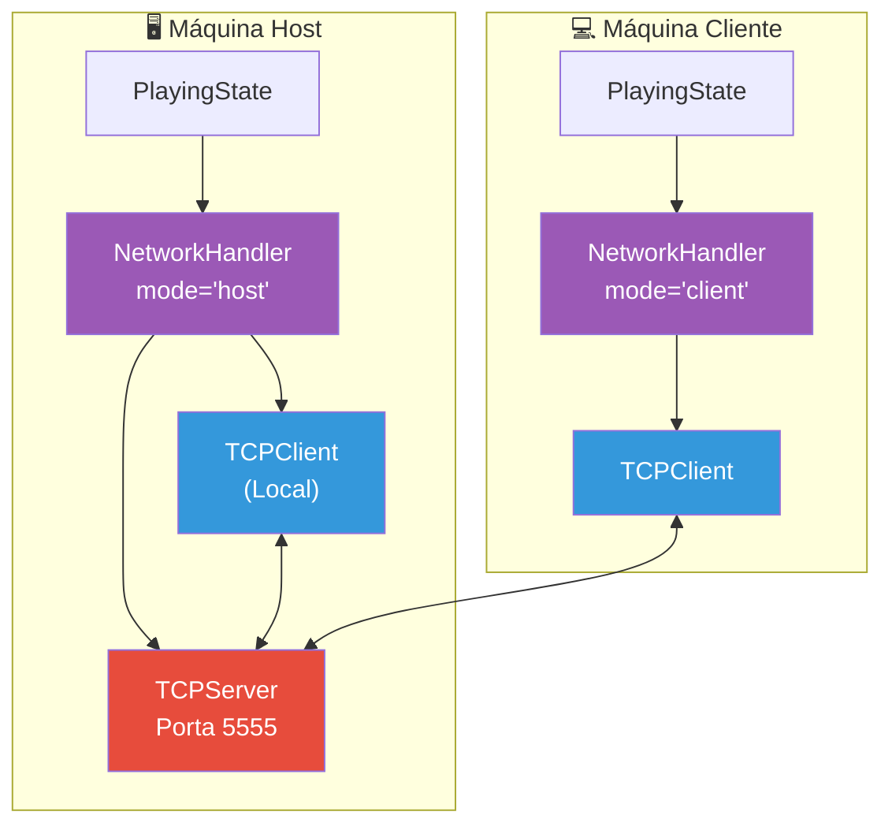
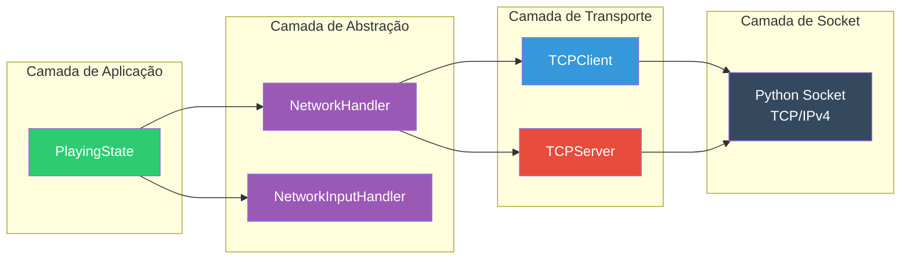
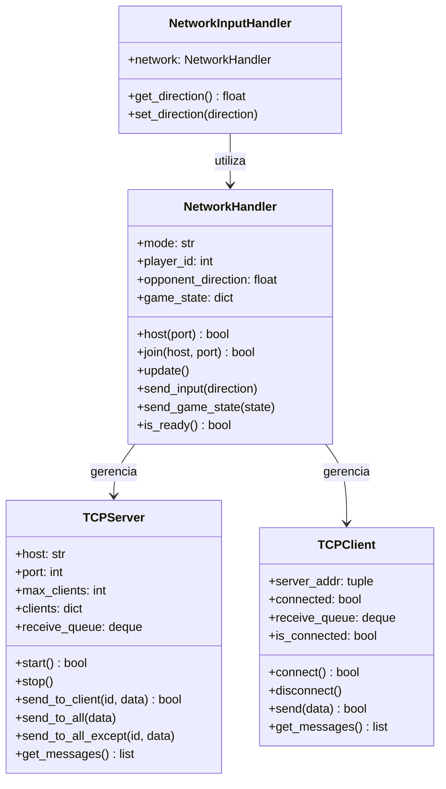
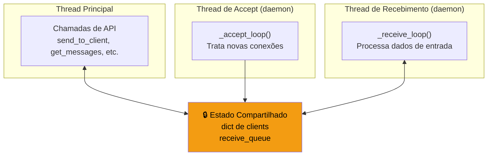
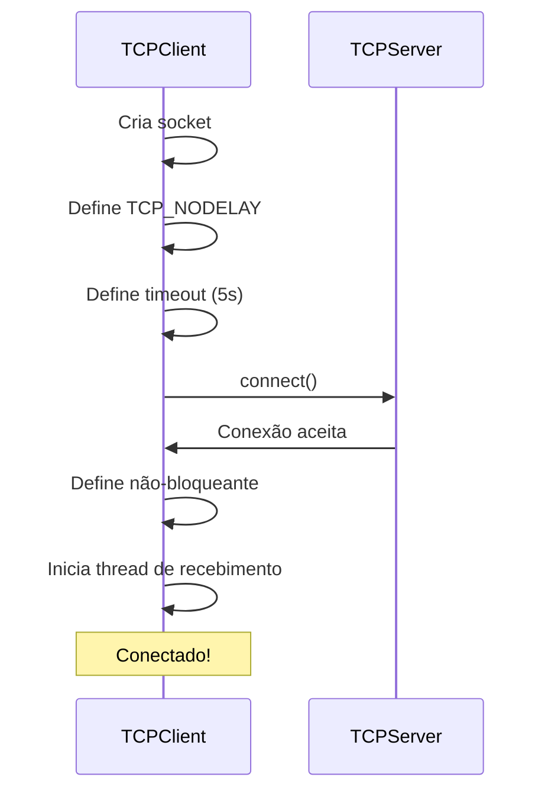
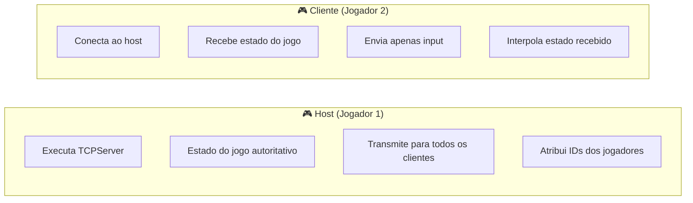
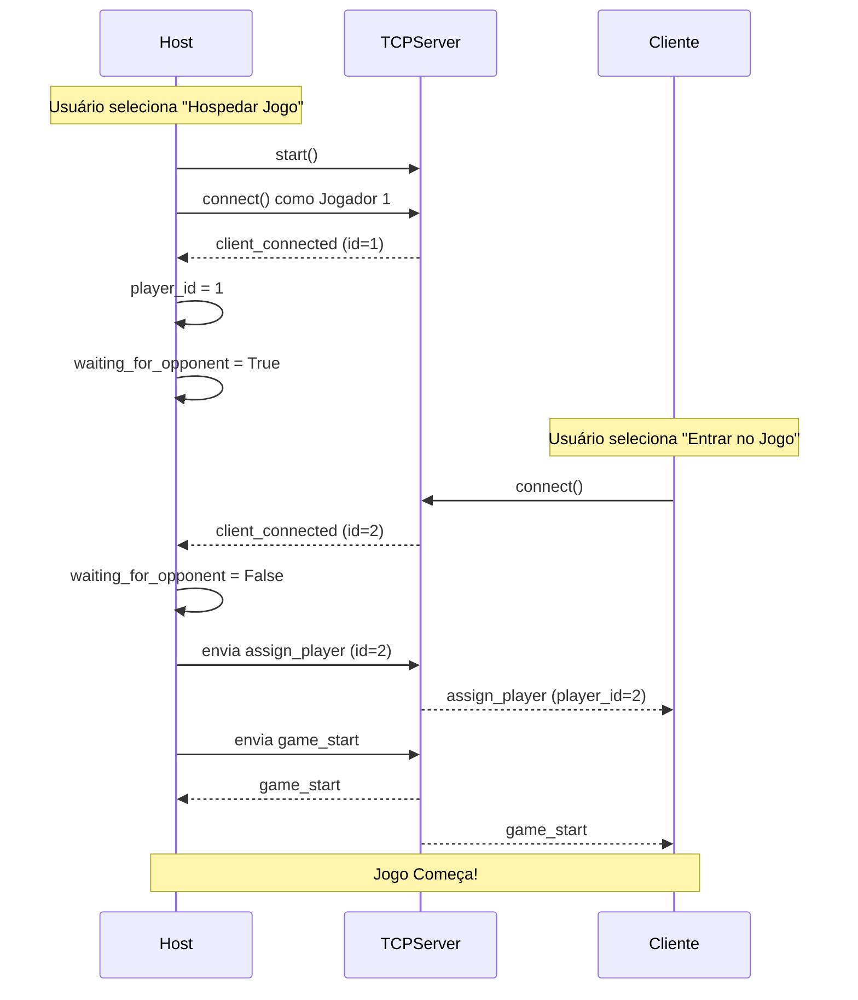
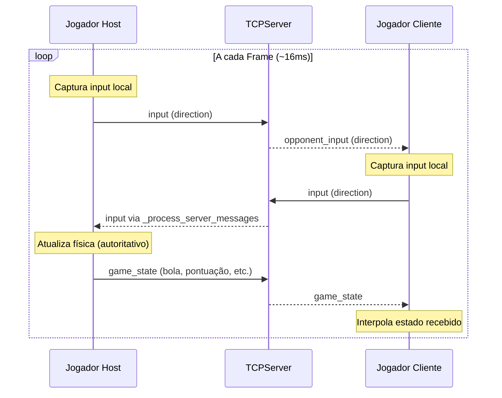
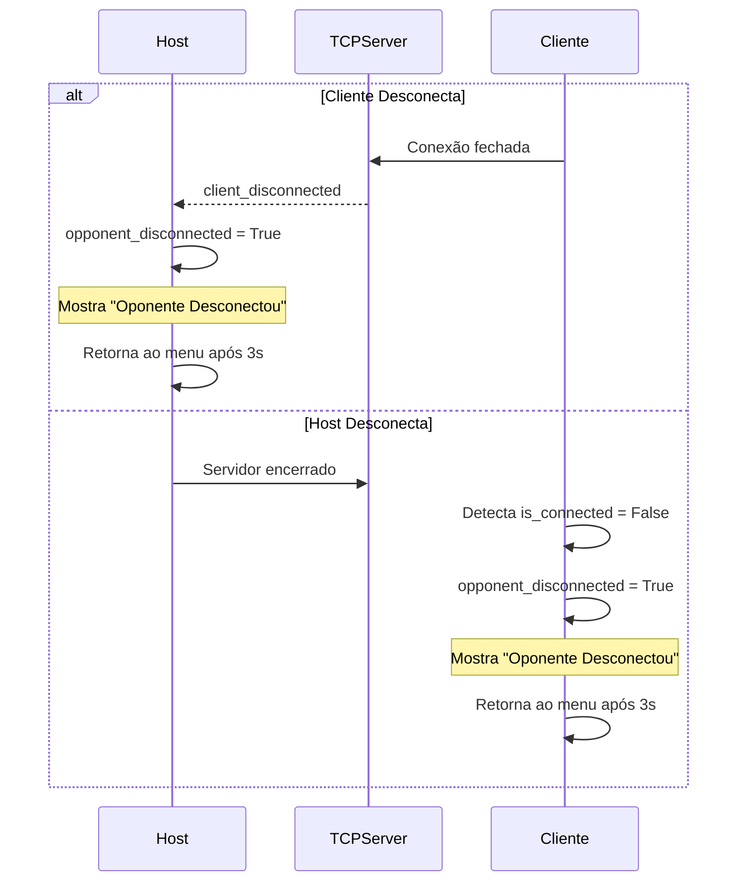
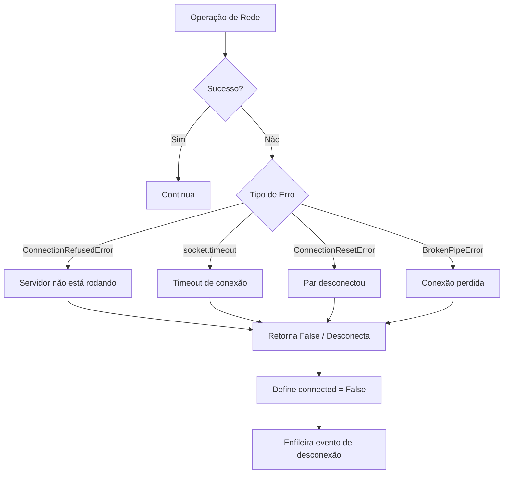

# 🌐 Documentação da Arquitetura de Rede do Ultra-Pong

> **Versão:** 1.0  
> **Última Atualização:** Dezembro 2024  
> **Autores:** Equipe de Desenvolvimento Ultra-Pong

---

## 📋 Índice

1. [Introdução](#introdução)
2. [Visão Geral da Arquitetura](#visão-geral-da-arquitetura)
3. [Estrutura do Módulo de Rede](#estrutura-do-módulo-de-rede)
4. [Protocolo de Comunicação](#protocolo-de-comunicação)
5. [Referência de Classes](#referência-de-classes)
6. [Diagramas de Fluxo de Mensagens](#diagramas-de-fluxo-de-mensagens)
7. [Guia de Integração](#guia-de-integração)
8. [Detalhes Técnicos](#detalhes-técnicos)

---

## Introdução

O sistema de rede do Ultra-Pong implementa uma **arquitetura cliente-servidor** utilizando **sockets TCP** para jogabilidade multiplayer em tempo real. Esta documentação cobre toda a implementação de rede, incluindo gerenciamento de conexões, sincronização de dados e transmissão do estado do jogo.

### Características Principais

| Característica | Descrição |
|----------------|-----------|
| **Protocolo** | TCP/IP com enquadramento de mensagens customizado |
| **Arquitetura** | Cliente-Servidor com host como servidor autoritativo |
| **Serialização** | Codificação de mensagens baseada em JSON |
| **Threading** | I/O não-bloqueante com threads dedicadas para recebimento |
| **Máx. Jogadores** | 2 (multiplayer 1v1)(no momento) |
| **Porta Padrão** | 5555 |

---

## Visão Geral da Arquitetura

### Arquitetura de Alto Nível do Sistema



### Pilha de Camadas de Rede



---

## Estrutura do Módulo de Rede

### Estrutura de Diretórios

```
network/
├── __init__.py          # Inicialização do módulo
├── server.py            # Implementação da classe TCPServer
├── client.py            # Implementação da classe TCPClient
├── network_handler.py   # API de alto nível NetworkHandler
└── network_input.py     # NetworkInputHandler para input de jogador remoto
```

### Responsabilidades dos Componentes



---

## Protocolo de Comunicação

### Enquadramento de Mensagens

Todas as mensagens utilizam um protocolo de enquadramento com **prefixo de tamanho** para garantir a entrega completa da mensagem via TCP:

```
┌─────────────────────────┬─────────────────────────────────────┐
│  Tamanho (4 bytes)      │       Payload JSON (N bytes)        │
│    Big-endian           │         Codificado em UTF-8         │
└─────────────────────────┴─────────────────────────────────────┘
```

**Processo de Codificação:**
```python
payload = json.dumps(data).encode('utf-8')      # Serializa para JSON
length_prefix = len(payload).to_bytes(4, 'big')  # Cabeçalho de 4 bytes
message = length_prefix + payload                 # Mensagem completa
```

**Processo de Decodificação:**
```python
msg_length = int.from_bytes(buffer[:4], 'big')  # Lê cabeçalho de tamanho
payload = buffer[4:4 + msg_length]               # Extrai payload
data = json.loads(payload.decode('utf-8'))       # Deserializa JSON
```

### Tipos de Mensagens

| Tipo | Direção | Descrição |
|------|---------|-----------|
| `client_connected` | Servidor → Interno | Notifica nova conexão de cliente |
| `client_disconnected` | Servidor → Interno | Notifica desconexão de cliente |
| `assign_player` | Servidor → Cliente | Atribui ID do jogador ao cliente |
| `game_start` | Servidor → Todos | Sinaliza que o jogo pode começar |
| `input` | Cliente → Servidor | Input de movimento da raquete do jogador |
| `opponent_input` | Servidor → Cliente | Input do oponente retransmitido |
| `game_state` | Servidor → Todos | Atualização autoritativa do estado do jogo |

### Esquemas de Mensagens

#### Cliente Conectado (Evento Interno)
```json
{
    "type": "client_connected",
    "client_id": 1,
    "address": ["192.168.1.10", 54321]
}
```

#### Atribuir Jogador
```json
{
    "type": "assign_player",
    "player_id": 2
}
```

#### Início do Jogo
```json
{
    "type": "game_start"
}
```

#### Mensagem de Input
```json
{
    "type": "input",
    "direction": 1.0
}
```
> **Nota:** Valores de direção: `-1.0` (cima), `0.0` (parado), `1.0` (baixo)

#### Input do Oponente
```json
{
    "type": "opponent_input",
    "direction": -1.0
}
```

#### Estado do Jogo (Autoritativo)
```json
{
    "type": "game_state",
    "ball_x": 640.5,
    "ball_y": 360.2,
    "ball_dx": 0.707,
    "ball_dy": -0.707,
    "ball_speed": 450,
    "score_t1": 3,
    "score_t2": 2,
    "phase": "play",
    "tick": 1542,
    "countdown_end": null
}
```

---

## Referência de Classes

### TCPServer

A classe `TCPServer` gerencia conexões de entrada e distribuição de mensagens.

#### Construtor

```python
TCPServer(host: str = '0.0.0.0', port: int = 5555, max_clients: int = 2)
```

| Parâmetro | Tipo | Padrão | Descrição |
|-----------|------|--------|-----------|
| `host` | str | `'0.0.0.0'` | Endereço de bind (todas as interfaces) |
| `port` | int | `5555` | Porta TCP para escutar |
| `max_clients` | int | `2` | Máximo de conexões simultâneas |

#### Métodos Principais

| Método | Retorno | Descrição |
|--------|---------|-----------|
| `start()` | `bool` | Inicia o servidor, retorna status de sucesso |
| `stop()` | `None` | Encerra o servidor |
| `send_to_client(id, data)` | `bool` | Envia dados para um cliente específico |
| `send_to_all(data)` | `None` | Transmite para todos os clientes conectados |
| `send_to_all_except(id, data)` | `None` | Transmite excluindo um cliente |
| `get_messages()` | `list` | Recupera e limpa a fila de mensagens |
| `get_client_count()` | `int` | Retorna número de clientes conectados |

#### Modelo de Threading



#### Configuração do Socket

```python
# Opções do socket do servidor
socket.SO_REUSEADDR    # Permite reutilização do endereço
socket.TCP_NODELAY     # Desabilita algoritmo de Nagle (baixa latência)
socket.SO_KEEPALIVE    # Habilita probes de keepalive
TCP_KEEPIDLE = 10      # Inicia keepalive após 10s ocioso
TCP_KEEPINTVL = 3      # Intervalo de keepalive: 3s
TCP_KEEPCNT = 3        # Desconecta após 3 probes falhados
```

---

### TCPClient

A classe `TCPClient` gerencia a conexão com o servidor do jogo.

#### Construtor

```python
TCPClient(server_ip: str = 'localhost', server_port: int = 5555)
```

#### Métodos Principais

| Método | Retorno | Descrição |
|--------|---------|-----------|
| `connect()` | `bool` | Estabelece conexão com o servidor |
| `disconnect()` | `None` | Fecha a conexão graciosamente |
| `send(data)` | `bool` | Envia dicionário como mensagem JSON |
| `get_messages()` | `list` | Recupera e limpa a fila de mensagens |
| `is_connected` | `bool` | Propriedade indicando status da conexão |

#### Fluxo de Conexão



---

### NetworkHandler

O `NetworkHandler` fornece uma API de alto nível abstraindo detalhes de cliente/servidor.

#### Construtor

```python
NetworkHandler(mode: str = 'client')
```

#### Propriedades

| Propriedade | Tipo | Descrição |
|-------------|------|-----------|
| `mode` | str | `'host'` ou `'client'` |
| `player_id` | int | Número do jogador atribuído (1 ou 2) |
| `connected` | bool | Status da conexão |
| `waiting_for_opponent` | bool | True enquanto aguarda segundo jogador |
| `opponent_disconnected` | bool | True se oponente saiu durante o jogo |

#### Métodos

| Método | Retorno | Descrição |
|--------|---------|-----------|
| `host(port)` | `bool` | Inicia servidor e conecta como jogador 1 |
| `join(host, port)` | `bool` | Entra em jogo existente como cliente |
| `update()` | `None` | Processa todas as mensagens pendentes de rede |
| `send_input(direction)` | `None` | Envia movimento da raquete do jogador local |
| `send_game_state(state)` | `None` | Apenas host: transmite estado do jogo |
| `get_opponent_direction()` | `float` | Retorna último input do oponente |
| `is_ready()` | `bool` | True se o jogo pode começar |
| `disconnect()` | `None` | Fecha todas as conexões |

#### Responsabilidades Host vs Cliente



---

### NetworkInputHandler

Um adaptador leve que fornece input do oponente para a classe `Player`.

```python
class NetworkInputHandler:
    def __init__(self, network_handler):
        self.network = network_handler
        
    def get_direction(self) -> float:
        return self.network.get_opponent_direction()
```

Esta classe implementa a mesma interface que `InputHandler`, permitindo integração seamless com o sistema de jogador.

---

## Diagramas de Fluxo de Mensagens

### Estabelecimento de Conexão



### Loop de Gameplay



### Tratamento de Desconexão



---

## Guia de Integração

### Configurando Multiplayer no PlayingState

A classe `PlayingState` integra com o sistema de rede através dos seguintes componentes principais:

#### Inicialização

```python
def enter(self, game_mode="local", network=None):
    self.game_mode = game_mode
    self.network = network
    
    # Reseta estado de desconexão
    self.opponent_disconnected = False
    self.disconnect_timer = 0.0
    
    # Configura jogadores baseado no modo
    self.setup_players()
```

#### Configuração de Jogadores para Multiplayer

```python
elif self.game_mode == "multiplayer_1v1" and self.network:
    local_controller = InputHandler(pygame.K_w, pygame.K_s)
    remote_controller = NetworkInputHandler(self.network)
    
    if self.network.player_id == 1:
        # Host é Jogador 1 (raquete esquerda)
        self.players['player1'] = Player("TEAM_1", local_controller, ...)
        self.players['player2'] = Player("TEAM_2", remote_controller, ...)
    else:
        # Cliente é Jogador 2 (raquete direita)
        self.players['player1'] = Player("TEAM_1", remote_controller, ...)
        self.players['player2'] = Player("TEAM_2", local_controller, ...)
```

#### Loop de Atualização de Rede

```python
def update(self, dt):
    if self.network:
        self.network.update()        # Processa mensagens de entrada
        self._send_local_input()     # Envia nosso input + estado do jogo
    
    # Verifica desconexão
    if not self.network.is_opponent_connected():
        self.opponent_disconnected = True
```

#### Enviando Input Local

```python
def _send_local_input(self):
    # Obtém direção do jogador local
    local_key = 'player1' if self.network.player_id == 1 else 'player2'
    direction = self.players[local_key].input_handler.get_direction()
    self.network.send_input(direction)
    
    # Host envia estado do jogo autoritativo
    if self.network.is_host():
        game_state = {
            'ball_x': self.ball.rect.centerx,
            'ball_y': self.ball.rect.centery,
            'ball_dx': self.ball.direction.x,
            'ball_dy': self.ball.direction.y,
            # ... mais estado
        }
        self.network.send_game_state(game_state)
```

#### Aplicando Estado do Jogo Recebido (Cliente)

```python
def _apply_game_state(self):
    state = self.network.get_game_state()
    
    # Interpolação suave para posição da bola
    lerp = 0.4
    self.ball.rect.centerx += (state['ball_x'] - self.ball.rect.centerx) * lerp
    self.ball.rect.centery += (state['ball_y'] - self.ball.rect.centery) * lerp
    
    # Atualização direta para direção e velocidade
    self.ball.direction.x = state['ball_dx']
    self.ball.direction.y = state['ball_dy']
    
    # Sincronização de pontuação e fase
    self.world.score['TEAM_1'] = state['score_t1']
    self.world.score['TEAM_2'] = state['score_t2']
```

---

## Detalhes Técnicos

### Segurança de Threads

O módulo de rede utiliza locks para proteger estado compartilhado:

```python
self.client_lock = threading.Lock()

# Exemplo de uso em send_to_all
def send_to_all(self, data: dict):
    with self.client_lock:
        for client_socket in list(self.clients.keys()):
            self._send_to_socket(client_socket, data)
```

### Gerenciamento de Buffer

Tanto cliente quanto servidor mantêm buffers de recebimento para lidar com mensagens parciais:

```python
self._recv_buffer = b''  # Cliente
self.clients[socket]['buffer'] = b''  # Servidor (por cliente)
```

O método `_process_buffer` garante que mensagens completas sejam extraídas:

```python
while len(buffer) >= 4:  # Mínimo: cabeçalho de 4 bytes
    msg_length = int.from_bytes(buffer[:4], 'big')
    
    if len(buffer) < 4 + msg_length:
        break  # Mensagem incompleta, aguarda mais dados
    
    payload = buffer[4:4 + msg_length]
    buffer = buffer[4 + msg_length:]
    # Processa payload...
```

### Otimizações de Performance

| Otimização | Implementação | Benefício |
|------------|---------------|-----------|
| **TCP_NODELAY** | Desabilita algoritmo de Nagle | Reduz latência de input |
| **I/O Não-bloqueante** | `socket.setblocking(False)` | Evita bloqueio de threads |
| **Polling com select()** | Usa `select.select()` com timeout | Multiplexação eficiente |
| **Threads daemon** | `daemon=True` nas threads | Encerramento limpo |
| **Deque para filas** | `collections.deque` | O(1) para append/popleft |
| **Interpolação linear** | 40% lerp no cliente | Suaviza atualizações de posição |

### Tratamento de Erros

O código de rede trata diversos cenários de falha:



---

## Referência de Configuração de Socket

### Opções do Socket do Servidor

```python
# Permite rebind rápido após reinício
socket.setsockopt(socket.SOL_SOCKET, socket.SO_REUSEADDR, 1)

# Envio de baixa latência
socket.setsockopt(socket.IPPROTO_TCP, socket.TCP_NODELAY, 1)

# Monitoramento de saúde da conexão
socket.setsockopt(socket.SOL_SOCKET, socket.SO_KEEPALIVE, 1)
socket.setsockopt(socket.IPPROTO_TCP, TCP_KEEPIDLE, 10)   # 10s antes do primeiro probe
socket.setsockopt(socket.IPPROTO_TCP, TCP_KEEPINTVL, 3)   # 3s entre probes
socket.setsockopt(socket.IPPROTO_TCP, TCP_KEEPCNT, 3)     # 3 probes falhados = desconexão
```

### Opções do Socket do Cliente

```python
# Envio de baixa latência
socket.setsockopt(socket.IPPROTO_TCP, socket.TCP_NODELAY, 1)

# Timeout de conexão inicial
socket.settimeout(5.0)

# Após conexão, muda para não-bloqueante
socket.setblocking(False)
```

---

## Resumo

A arquitetura de rede do Ultra-Pong fornece uma base robusta para jogabilidade multiplayer em tempo real:

> [!TIP]
> **Pontos-Chave:**
> - **Modelo autoritativo do host**: O host executa a simulação física e transmite o estado
> - **Clientes apenas com input**: Clientes enviam apenas a direção da raquete, minimizando banda
> - **JSON com prefixo de tamanho**: Protocolo simples e depurável com enquadramento confiável
> - **I/O com threads**: Design não-bloqueante mantém o loop do jogo responsivo
> - **Desconexão**: Tratamento limpo de falhas de rede com feedback ao usuário

---

*Documentação para Ultra-Pong v1.0*
