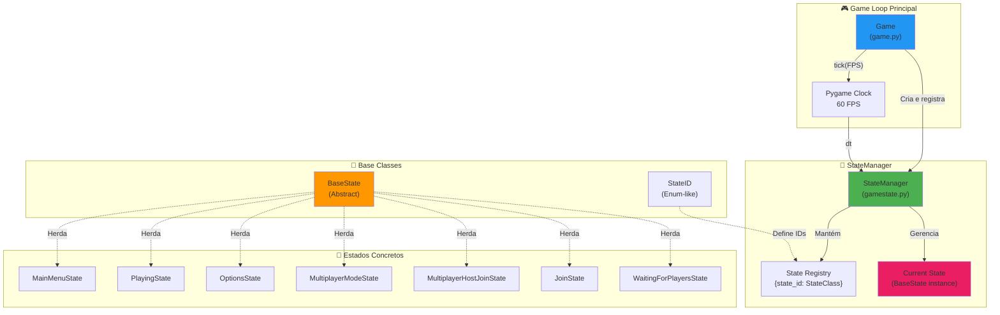
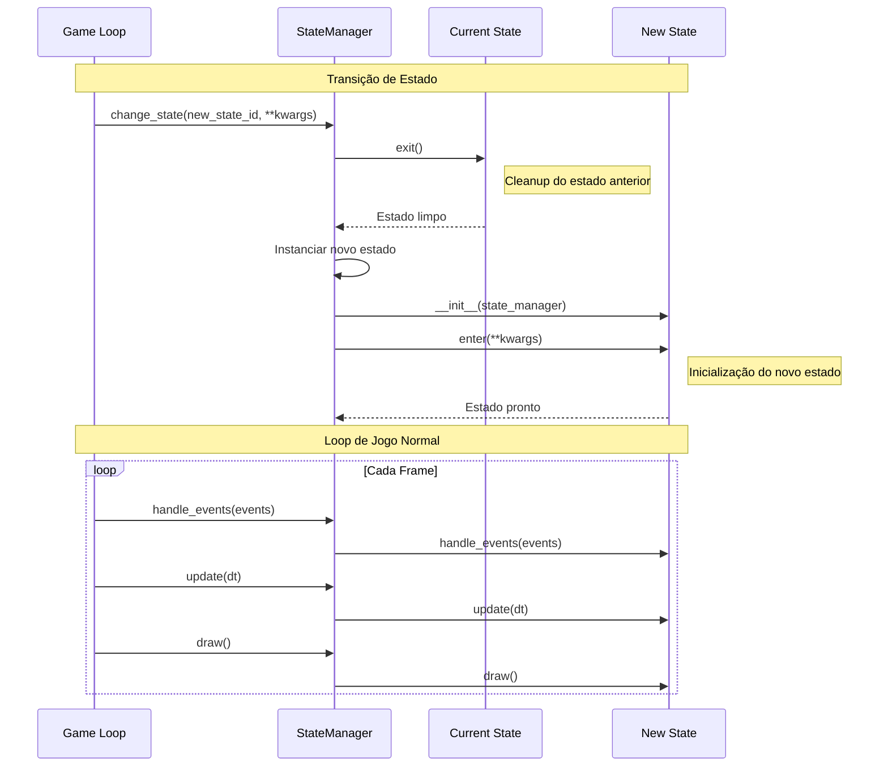
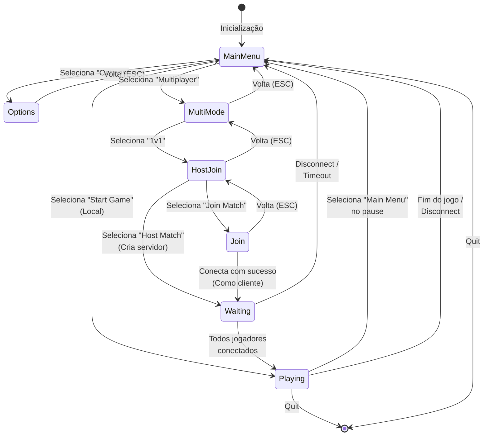

# 🎮 Documentação do Sistema de Estados do Ultra-Pong

> **Versão:** 1.0  
> **Última Atualização:** Dezembro 2024  
> **Autores:** Equipe de Desenvolvimento Ultra-Pong

---

## 📋 Índice

1. [Introdução](#introdução)
2. [Por Que Um Sistema de Estados?](#por-que-um-sistema-de-estados)
3. [Arquitetura do Sistema](#arquitetura-do-sistema)
4. [Componentes Principais](#componentes-principais)
5. [Fluxo de Estados](#fluxo-de-estados)
6. [Referência de Estados](#referência-de-estados)
7. [Benefícios da Arquitetura](#benefícios-da-arquitetura)
8. [Guia de Implementação](#guia-de-implementação)

---

## Introdução

O sistema de estados do Ultra-Pong implementa o **State Pattern** (Padrão de Estados) para gerenciar diferentes telas e modos do jogo de forma organizada, escalável e manutenível. Esta documentação explica as decisões de design, benefícios e como o sistema funciona.

### Características Principais

| Característica | Descrição |
|----------------|-----------|
| **Padrão de Design** | State Pattern com gerenciador centralizado |
| **Desacoplamento** | Estados independentes e autocontidos |
| **Transições** | Sistema de transição com passagem de parâmetros |
| **Ciclo de Vida** | Métodos enter/exit para inicialização e limpeza |
| **Total de Estados** | 7 estados principais implementados |

---

## Por Que Um Sistema de Estados?

### ❌ Problema Sem Sistema de Estados

Sem um sistema de estados adequado, o código do jogo rapidamente se torna caótico:

```python
# ❌ Abordagem Problemática
def game_loop():
    while running:
        if in_main_menu:
            draw_menu()
            if click_start:
                in_main_menu = False
                in_game = True
        elif in_game:
            if paused:
                draw_pause()
            else:
                update_game()
        elif in_options:
            # ...
        # Código continua crescendo exponencialmente
```

**Problemas dessa abordagem:**
- 🔴 **Código Espaguete:** Lógica entrelaçada e difícil de seguir
- 🔴 **Difícil Manutenção:** Mudanças afetam múltiplas partes do código
- 🔴 **Bugs Frequentes:** Estados inconsistentes e vazamento de estado
- 🔴 **Escalabilidade Limitada:** Adicionar novos estados é exponencialmente complexo
- 🔴 **Teste Impossível:** Não é possível testar estados isoladamente

### ✅ Solução: State Pattern

O State Pattern resolve esses problemas encapsulando cada estado em sua própria classe:

```python
# ✅ Abordagem com State Pattern
class BaseState:
    def enter(self): pass
    def exit(self): pass
    def handle_events(self, events): pass
    def update(self, dt): pass
    def draw(self): pass

class MainMenuState(BaseState):
    # Toda lógica do menu principal encapsulada aqui
    pass

class PlayingState(BaseState):
    # Toda lógica do jogo encapsulada aqui
    pass
```

---

## Arquitetura do Sistema

### Diagrama de Arquitetura



### Fluxo de Execução



---

## Componentes Principais

### 1. StateID (Identificadores de Estado)

**Arquivo:** `gamestate.py`

```python
class StateID:
    MAIN_MENU        = "main_menu"
    OPTIONS          = "options"
    PLAYING          = "playing"
    MULTI_MODE       = "multi_mode"
    MULTI_HOST_JOIN  = "multi_host_join"
    WAITING          = "waiting"
    JOIN             = "join"
```

**Propósito:**
- Centraliza todos os identificadores de estado
- Evita strings mágicas espalhadas pelo código
- Facilita refatoração e manutenção
- Tipo-seguro (dificulta erros de digitação)

**Por que é importante:**
```python
# ❌ Ruim: String mágica
state_manager.change_state("main_menu")  # Pode ter typo

# ✅ Bom: Constante centralizada
state_manager.change_state(StateID.MAIN_MENU)  # IDE autocompleta
```

---

### 2. BaseState (Classe Base Abstrata)

**Arquivo:** `gamestate.py`

```python
class BaseState:
    def __init__(self, state_manager):
        self.state_manager = state_manager
        self.screen = state_manager.screen
    
    def enter(self, **kwargs):
        """Chamado quando o estado é ativado"""
        pass

    def exit(self):
        """Chamado quando o estado é desativado"""
        pass

    def handle_events(self, events):
        """Processa eventos de input (teclado, mouse, etc)"""
        pass

    def update(self, dt):
        """Atualiza lógica do estado (física, IA, etc)"""
        pass

    def draw(self):
        """Renderiza o estado na tela"""
        pass
```

**Design Decisions (Decisões de Design):**

#### ✅ Por que herdar de uma classe base?

1. **Contrato Consistente:** Garante que todos os estados implementam os mesmos métodos
2. **Polimorfismo:** StateManager pode tratar todos os estados uniformemente
3. **Código Reutilizável:** Funcionalidade comum (acesso à tela) em um só lugar
4. **Fácil Extensão:** Novos estados apenas herdam e sobrescrevem o necessário

#### ✅ Por que passar state_manager no construtor?

```python
def __init__(self, state_manager):
    self.state_manager = state_manager  # Permite transições
    self.screen = state_manager.screen  # Acesso direto à tela
```

**Benefícios:**
- Estados podem iniciar transições: `self.state_manager.change_state(...)`
- Acesso à tela para renderização sem dependências extras
- Acesso a outros recursos gerenciados centralmente

#### ✅ Por que enter() e exit()?

**Ciclo de Vida Explícito:**

```python
def enter(self, **kwargs):
    """Inicialização do estado"""
    # - Resetar variáveis
    # - Carregar recursos
    # - Iniciar música
    # - Receber dados do estado anterior via kwargs
    pass

def exit(self):
    """Limpeza do estado"""
    # - Desconectar da rede
    # - Parar música
    # - Liberar recursos
    pass
```

**Vantagens:**
- **Previsível:** Sempre sabemos quando o estado inicia e termina
- **Sem Vazamento:** Recursos são limpos adequadamente
- **Reinicializável:** Estado pode ser reiniciado do zero
- **Passagem de Dados:** `kwargs` permite passar informações entre estados

---

### 3. StateManager (Gerenciador Central)

**Arquivo:** `gamestate.py`

```python
class StateManager:
    def __init__(self, screen):
        self.screen = screen
        self.states = {}              # Registry de classes
        self.current_state = None     # Instância ativa
        self.running = True           # Flag de execução

    def register_state(self, state_id, state_class):
        """Registra uma classe de estado"""
        self.states[state_id] = state_class
    
    def change_state(self, new_state_id, **kwargs):
        """Transição entre estados"""
        # 1. Cleanup do estado anterior
        if self.current_state:
            self.current_state.exit()

        # 2. Instanciar e inicializar novo estado
        if new_state_id in self.states:
            self.current_state = self.states[new_state_id](self)
            self.current_state.enter(**kwargs)
        else:
            raise ValueError(f"Estado desconhecido: {new_state_id}")
```

**Design Decisions:**

#### ✅ Por que um gerenciador centralizado?

**Single Responsibility Principle (Princípio da Responsabilidade Única):**

| Componente | Responsabilidade |
|------------|------------------|
| **StateManager** | Gerencia transições e ciclo de vida |
| **BaseState** | Define interface comum |
| **Estados Concretos** | Implementam lógica específica |
| **Game Loop** | Coordena atualização e renderização |

#### ✅ Por que registry pattern?

```python
# Registro na inicialização
self.state_manager.register_state(StateID.MAIN_MENU, MainMenuState)
self.state_manager.register_state(StateID.PLAYING, PlayingState)

# Instanciação lazy (apenas quando necessário)
self.current_state = self.states[new_state_id](self)
```

**Benefícios:**
- **Lazy Loading:** Estados só são criados quando necessários
- **Desacoplamento:** Game loop não conhece classes específicas
- **Flexibilidade:** Fácil adicionar/remover estados
- **Testabilidade:** Mock de estados para testes

#### ✅ Por que delegar chamadas?

```python
def handle_events(self, events):
    if self.current_state:
        self.current_state.handle_events(events)

def update(self, dt):
    if self.current_state:
        self.current_state.update(dt)
        
def draw(self):
    if self.current_state:
        self.current_state.draw()
```

**Vantagens:**
- **Encapsulamento:** Game loop não conhece detalhes dos estados
- **Polimorfismo:** Mesmo código funciona para todos os estados
- **Segurança:** Check de null evita crashes

---

## Fluxo de Estados

### Máquina de Estados Completa



### Exemplo de Transição com Dados

```python
# Estado A -> Estado B com dados
class StateA(BaseState):
    def some_action(self):
        # Passar dados para o próximo estado
        self.state_manager.change_state(
            StateID.STATE_B,
            player_id=1,
            game_mode="1v1",
            network=self.network
        )

class StateB(BaseState):
    def enter(self, player_id=None, game_mode=None, network=None):
        # Receber dados do estado anterior
        self.player_id = player_id
        self.game_mode = game_mode
        self.network = network
        # Inicializar com base nos dados recebidos
```

---

## Referência de Estados

### Estados Implementados

| Estado | Arquivo | Propósito | Transições Principais |
|--------|---------|-----------|----------------------|
| **MainMenuState** | `menustate.py` | Menu principal do jogo | → Options, Playing, MultiMode |
| **OptionsState** | `menu_state/optionsstate.py` | Configurações do jogo | → MainMenu |
| **PlayingState** | `playingstate.py` | Gameplay principal | → MainMenu, (pause interno) |
| **MultiplayerModeState** | `menu_state/multiplayerstate.py` | Seleção 1v1/2v2 | → HostJoin, MainMenu |
| **MultiplayerHostJoinState** | `menu_state/multiplayerstate.py` | Escolha Host/Join | → Waiting, Join, MultiMode |
| **JoinState** | `menu_state/joinstate.py` | Input de IP/Porta | → Waiting, HostJoin |
| **WaitingForPlayersState** | `menu_state/waitingstate.py` | Lobby de espera | → Playing, MainMenu |

### Detalhamento por Estado

#### 🏠 MainMenuState

**Responsabilidades:**
- Exibir menu principal com opções
- Reproduzir música tema
- Navegar entre opções com teclado
- Efeitos visuais (cursor animado, background)

**Transições:**
```python
"Start Game"   → StateID.PLAYING (modo local)
"Multiplayer"  → StateID.MULTI_MODE
"Options"      → StateID.OPTIONS
"Quit"         → state_manager.quit()
```

**Dados Passados:**
- Nenhum para modo local
- `game_mode` para multiplayer

---

#### 🎮 PlayingState

**Responsabilidades:**
- Gerenciar gameplay (física, colisões, placar)
- Controlar pausa (local e remota via rede)
- Sincronizar estado via rede (se multiplayer)
- Reproduzir música de jogo
- Gerenciar UI (placar, countdown)

**Dados Recebidos em `enter()`:**
```python
def enter(self, game_mode="local", network=None):
    self.game_mode = game_mode  # "local" ou "multiplayer_1v1"
    self.network = network       # NetworkHandler ou None
```

**Estados Internos:**
- Normal gameplay
- Pause local (menu de pause)
- Pause remoto (mensagem de espera)
- Countdown (após gol)
- Disconnect (mensagem de desconexão)

**Por que estados internos?**
- **Encapsulamento:** Lógica de pause não precisa ser um estado global
- **Contexto:** Pause mantém contexto do jogo
- **Performance:** Não recria objetos de jogo

---

#### ⚙️ OptionsState

**Responsabilidades:**
- Permitir ajuste de velocidades (bola, jogador)
- Configurar countdown
- Persistir configurações globais

**Características:**
- Modifica `settings.py` (OBJECTS_SPEED, COUNTDOWN)
- Sincroniza valores ao entrar (`_sync_from_settings()`)
- Aplica valores ao sair (`_apply_setting()`)

---

#### 🌐 Estados de Multiplayer

**Fluxo Multiplayer:**
```
MainMenu → MultiMode → HostJoin → {Waiting ou Join} → Waiting → Playing
```

**Por que tantos estados?**
- **Separação de Preocupações:** Cada tela tem responsabilidade única
- **Navegação Clara:** Usuário sempre sabe onde está
- **Cancelamento Fácil:** ESC volta para estado anterior
- **Reutilização:** Estados podem ser combinados diferentemente

**Passagem de Network Object:**
```python
# Host cria servidor
network = NetworkHandler()
network.host(5555)
self.state_manager.change_state(StateID.WAITING, 
                                network=network, 
                                is_host=True)

# Cliente conecta
network = NetworkHandler()
network.join(ip, port)
self.state_manager.change_state(StateID.WAITING, 
                                network=network, 
                                is_host=False)
```

---

## Benefícios da Arquitetura

### 1. 🧩 Modularidade

**Cada estado é um módulo independente:**

```python
# Estados podem ser desenvolvidos paralelamente
team_a_works_on = "menustate.py"
team_b_works_on = "playingstate.py"
# Sem conflitos!
```

**Vantagens:**
- Desenvolvimento paralelo eficiente
- Merge conflicts minimizados
- Testes independentes

---

### 2. 🔒 Encapsulamento

**Estado não vaza para outros estados:**

```python
class PlayingState(BaseState):
    def __init__(self, state_manager):
        super().__init__(state_manager)
        # Variáveis privadas deste estado
        self.ball = None
        self.players = {}
        self.paused = False
        # Outros estados não podem acessar
```

**Vantagens:**
- Sem dependências ocultas
- Mudanças localizadas
- Bugs isolados

---

### 3. 📈 Escalabilidade

**Adicionar novo estado é trivial:**

```python
# 1. Definir ID
class StateID:
    NEW_STATE = "new_state"

# 2. Criar classe
class NewState(BaseState):
    def enter(self): pass
    def draw(self): pass
    # ...

# 3. Registrar
state_manager.register_state(StateID.NEW_STATE, NewState)

# 4. Usar
state_manager.change_state(StateID.NEW_STATE)
```

**Complexidade:** O(1) - Constante, não importa quantos estados existem!

---

### 4. 🧪 Testabilidade

**Estados podem ser testados isoladamente:**

```python
def test_main_menu():
    # Criar mock do state manager
    mock_manager = MockStateManager()
    
    # Instanciar estado isoladamente
    menu = MainMenuState(mock_manager)
    menu.enter()
    
    # Testar comportamento
    assert menu.current_index == 0
    
    # Simular eventos
    menu.handle_events([KEY_DOWN_EVENT])
    assert menu.current_index == 1
```

---

### 5. 🛠️ Manutenibilidade

**Encontrar e corrigir bugs é direto:**

```python
# Bug: Menu não responde ao ESC
# Solução: Olhar apenas em menustate.py, handle_events()

def handle_events(self, events):
    for event in events:
        if event.key == pygame.K_ESCAPE:  # ← Fácil de encontrar
            self.state_manager.quit()
```

**Vantagens:**
- Código organizado logicamente
- Fácil navegação (cada estado é um arquivo)
- Debug localizado

---

### 6. 🔄 Reutilização

**Padrões podem ser extraídos:**

```python
# Classe base para menus
class MenuStateBase(BaseState):
    def __init__(self, state_manager):
        super().__init__(state_manager)
        self.current_index = 0
        self.time = 0
    
    def draw_cursor(self, option_rect):
        offset = 6 * math.sin(self.time * 6)
        # Desenhar cursor animado
        # Todos os menus herdam esse comportamento!
```

---

### 7. 🔍 Debugabilidade

**Estado atual é sempre conhecido:**

```python
def debug_info():
    current = state_manager.current_state
    print(f"Estado atual: {current.__class__.__name__}")
    print(f"Variáveis: {vars(current)}")
    # Inspeção completa do estado
```

---

## Guia de Implementação

### Como Criar um Novo Estado

**Passo 1: Definir ID**

```python
# gamestate.py
class StateID:
    # ... estados existentes
    MY_NEW_STATE = "my_new_state"
```

**Passo 2: Criar Classe**

```python
# my_new_state.py
from gamestate import BaseState, StateID
from settings import *

class MyNewState(BaseState):
    def __init__(self, state_manager):
        super().__init__(state_manager)
        # Inicializar variáveis de instância
        self.my_var = None
    
    def enter(self, **kwargs):
        """Chamado ao entrar no estado"""
        # Receber parâmetros
        self.data = kwargs.get('data', None)
        # Inicializar recursos
        # Começar música, resetar variáveis, etc.
    
    def exit(self):
        """Chamado ao sair do estado"""
        # Limpar recursos
        # Parar música, desconectar rede, etc.
    
    def handle_events(self, events):
        """Processar input do usuário"""
        for event in events:
            if event.type == pygame.KEYDOWN:
                if event.key == pygame.K_ESCAPE:
                    self.state_manager.change_state(StateID.MAIN_MENU)
                # Outros inputs...
    
    def update(self, dt):
        """Atualizar lógica (60 FPS)"""
        # Física, IA, animações, etc.
        pass
    
    def draw(self):
        """Renderizar na tela"""
        self.screen.fill((0, 0, 0))
        # Desenhar elementos...
```

**Passo 3: Registrar no Game**

```python
# game.py
from my_new_state import MyNewState

class Game:
    def __init__(self):
        # ...
        self.state_manager.register_state(StateID.MY_NEW_STATE, MyNewState)
```

**Passo 4: Usar**

```python
# De qualquer outro estado
self.state_manager.change_state(
    StateID.MY_NEW_STATE, 
    data="Hello, new state!"
)
```

---

### Padrões Comuns

#### Padrão: Estado com Timer

```python
class TimedState(BaseState):
    def enter(self):
        self.timer = 3.0  # 3 segundos
    
    def update(self, dt):
        self.timer -= dt
        if self.timer <= 0:
            self.state_manager.change_state(StateID.NEXT_STATE)
    
    def draw(self):
        # Mostrar countdown
        text = f"Transição em {self.timer:.1f}s"
        # Renderizar...
```

#### Padrão: Estado com Menu

```python
class MenuState(BaseState):
    def enter(self):
        self.options = ["Option 1", "Option 2", "Back"]
        self.current_index = 0
    
    def handle_events(self, events):
        for event in events:
            if event.key == pygame.K_UP:
                self.current_index = (self.current_index - 1) % len(self.options)
            elif event.key == pygame.K_DOWN:
                self.current_index = (self.current_index + 1) % len(self.options)
            elif event.key == pygame.K_RETURN:
                self._activate_option()
    
    def _activate_option(self):
        selected = self.options[self.current_index]
        if selected == "Back":
            self.state_manager.change_state(StateID.PREVIOUS_STATE)
        # ...
```

#### Padrão: Estado com Recursos Carregados

```python
class ResourceHeavyState(BaseState):
    def enter(self):
        # Carregar recursos pesados
        self.images = load_images()
        self.sounds = load_sounds()
        print("Recursos carregados!")
    
    def exit(self):
        # Liberar memória
        del self.images
        del self.sounds
        print("Recursos liberados!")
```

---

## Comparação com Alternativas

### State Pattern vs. If-Else

| Aspecto | If-Else | State Pattern |
|---------|---------|---------------|
| **Complexidade** | O(n²) - Cresce exponencialmente | O(1) - Constante |
| **Manutenção** | Difícil - Código entrelaçado | Fácil - Estados isolados |
| **Bugs** | Frequentes - Estados inconsistentes | Raros - Encapsulamento |
| **Escalabilidade** | Limitada - Adicionar estados é custoso | Excelente - Trivial adicionar estados |
| **Testabilidade** | Baixa - Difícil isolar | Alta - Estados independentes |
| **Legibilidade** | Baixa - Lógica confusa | Alta - Clara estrutura |

### State Pattern vs. Scene Stack

**Scene Stack:**
```python
scenes = []
scenes.push(MainMenu())
scenes.push(Options())  # Options sobre Menu
scenes.pop()            # Volta para Menu
```

**Quando usar cada um:**

| Sistema | Melhor Para | Ultra-Pong Usa? |
|---------|-------------|-----------------|
| **State Pattern** | Transições exclusivas (um estado de cada vez) | ✅ Sim |
| **Scene Stack** | Sobreposição (pause sobre jogo) | ❌ Não (pause é interno) |

**Por que State Pattern para Ultra-Pong?**
- Estados são mutuamente exclusivos (nunca 2 simultaneamente)
- Transições são claras e diretas
- Não precisa voltar para estado anterior frequentemente

---

## Conclusão

### Resumo dos Benefícios

✅ **Organização:** Código estruturado e fácil de navegar  
✅ **Escalabilidade:** Adicionar estados é trivial  
✅ **Manutenção:** Bugs isolados, mudanças localizadas  
✅ **Testabilidade:** Estados podem ser testados isoladamente  
✅ **Clareza:** Lógica de cada tela em um lugar  
✅ **Profissionalismo:** Padrão de design reconhecido na indústria

### Lições Aprendidas

1. **Separação de Responsabilidades:** Cada estado cuida apenas de si
2. **Ciclo de Vida Explícito:** `enter()` e `exit()` evitam vazamentos
3. **Gerenciamento Centralizado:** StateManager como único ponto de controle
4. **Polimorfismo:** Mesma interface, comportamentos diferentes
5. **Passagem de Dados:** `**kwargs` permite comunicação flexível entre estados

### Por Que Esta Arquitetura Funcionou

O sistema de estados do Ultra-Pong é bem-sucedido porque:

- **Começou Simples:** BaseState minimalista, fácil de entender
- **Cresceu Organicamente:** Novos estados adicionados sem refatoração massiva
- **Manteve Consistência:** Todos os estados seguem o mesmo padrão
- **Facilitou Colaboração:** Múltiplos desenvolvedores trabalhando em paralelo
- **Permitiu Iteração:** Mudanças localizadas, testes rápidos

---

### Próximos Passos

**Possíveis Melhorias:**

1. **Estado de Loading:** Para carregamento de assets pesados
2. **Estado de Tutorial:** Ensinar controles aos novos jogadores  
3. **Estado de Replay:** Rever últimas partidas
4. **Estado de Leaderboard:** Ranking de jogadores
5. **Transition Effects:** Animações entre estados

**Como adicionar:**
```python
# Apenas seguir o padrão estabelecido!
class LoadingState(BaseState):
    # Implementar interface
    pass

# Registrar
state_manager.register_state(StateID.LOADING, LoadingState)

# Usar
state_manager.change_state(StateID.LOADING, next_state=StateID.PLAYING)
```

---

## Referências

### Arquivos Relacionados

- `gamestate.py` - Definição do sistema de estados
- `game.py` - Inicialização e registro de estados
- `playingstate.py` - Estado de gameplay principal
- `menustate.py` - Menu principal
- `menu_state/*.py` - Estados de menu diversos

### Padrões de Design

- [State Pattern - Refactoring Guru](https://refactoring.guru/design-patterns/state)
- [Game Programming Patterns - State](https://gameprogrammingpatterns.com/state.html)

### Documentações Relacionadas

- `NETWORK_DOCUMENTATION.md` - Sistema de rede (complementar)
- `Menu_documentation.md` - Detalhes dos menus

---

**Documentação mantida pela Equipe Ultra-Pong**  
*Última revisão: Dezembro 2024*
